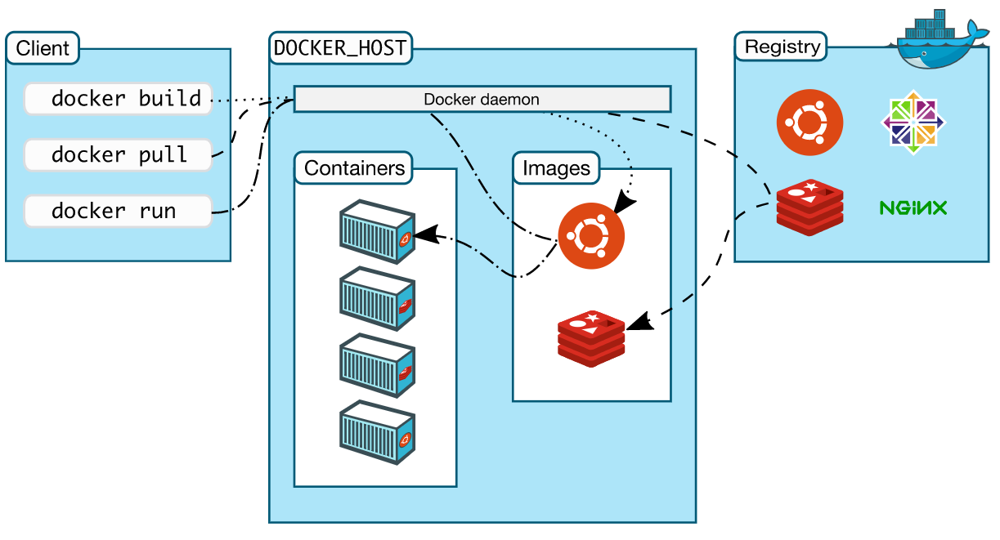
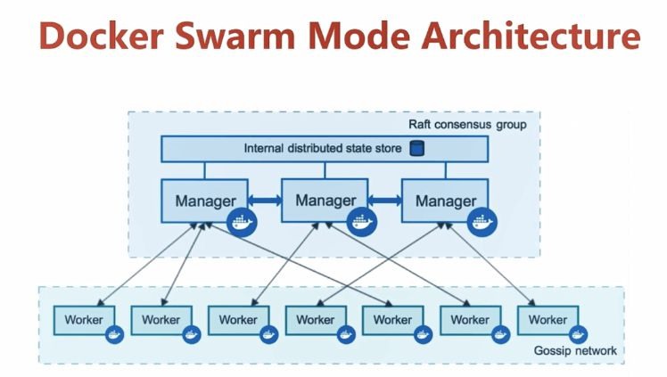
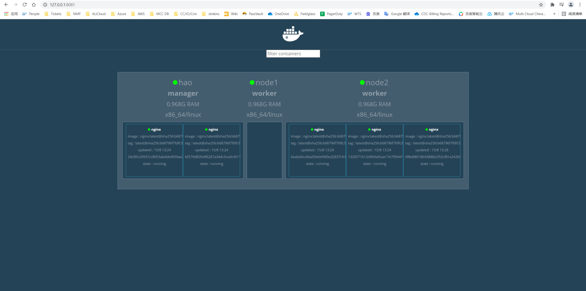
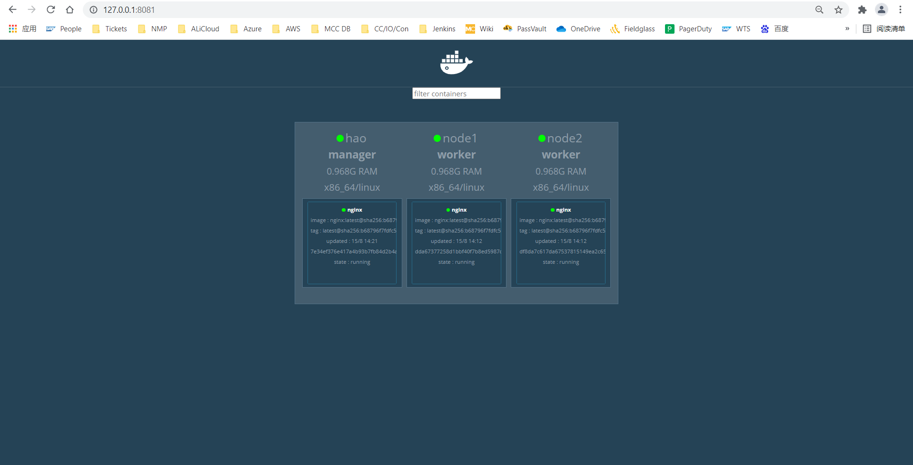
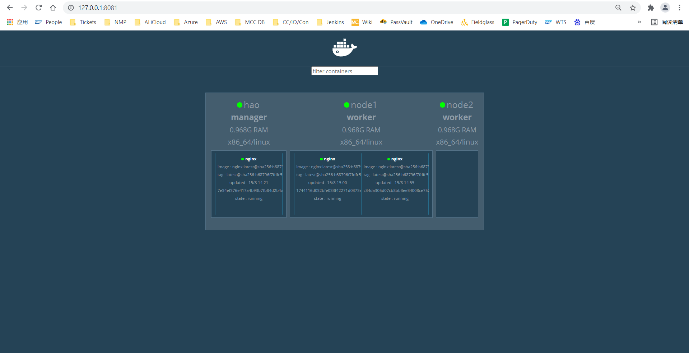
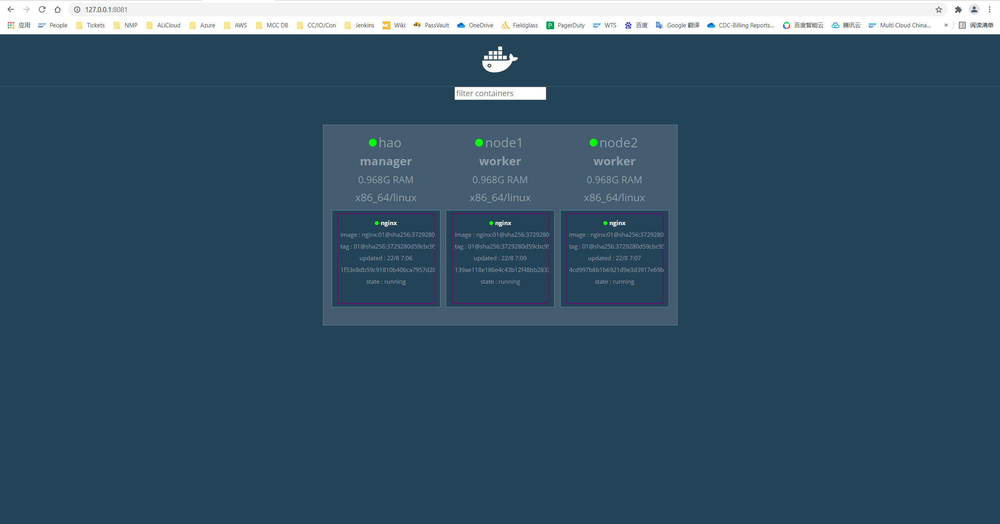
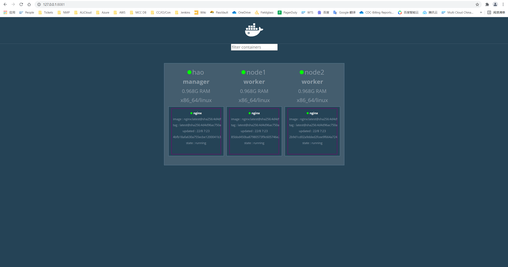

<h1 align = "center">Docker学习笔记</h1>

​																																																			——by 王浩

[toc]

# 一、Docker概述

## 1、Docker的特点及用途

### （1）特点

* 与传统的虚拟机的比较，传统虚拟机虚拟出一套硬件，运行一个完整的操作系统，然后在这个系统上安装和运行软件，容器没有自己的内核，直接运行在宿主机的内核上，没有虚拟的硬件，轻便
* 每个容器的相互隔离，每个容器内部都有一个属于自己的文件系统，互不影响

|            | Docker容器              | 虚拟机（VM）                |
| ---------- | ----------------------- | --------------------------- |
| 操作系统   | 与宿主机共享OS          | 宿主机OS上运行宿主机OS      |
| 存储大小   | 镜像小，便于存储与传输  | 镜像庞大（vmdk等）          |
| 运行性能   | 几乎无额外性能损失      | 操作系统额外的cpu、内存消耗 |
| 移植性     | 轻便、灵活、适用于Linux | 笨重、与虚拟化技术耦合度高  |
| 硬件亲和性 | 面向软件开发者          | 面向硬件运维者              |

### （2）用途

**DevOps**

* 更快速的交付和部署应用

* 更便捷的升级和扩缩容

* 更简单的系统运维

* 更高效的计算资源的利用

## 2、Docker的基本组成



### （1）镜像image

docker镜像就好比是一个模板，可以通过这个模板来创建容器服务，通过镜像可以创建多个容器

### （2）容器container

docker利用容器技术，独立运行一个或者一组应用，通过镜像来创建的，目前可以把容器理解为建议的linux系统

### （3）仓库repository

存放镜像的地方，可拉取、推送镜像

默认仓库是国外的dockerhub， 也可以配置镜像加速来设置

## 3、Docker的下载安装

### （1）下载地址

https://docs.docker.com/engine/install/centos/

### （2）文档地址

https://docs.docker.com/


# 二、Docker基本操作命令


## 1、查看docker版本和系统信息

### （1）使用之前要先启动

```shell
systemctl start docker
```

### （2）查看版本信息version

```shell
docker version
```

### （3）查看设备信息info

#如镜像容器数量、服务器版本、存储驱动程序、内核版本、操作系统、总内存等

```shell
docker info
```

## 2、docker hub操作命令

### （1）在docker hub上搜索镜像search

根据名字和标签搜索所有的镜像

```shell
#docker search image_name:tag

docker search centos:7
```

--filter= condition: 根据条件过滤

--limit number：设置显示的最大条数

### （2）在docker hub上拉取镜像pull

根据镜像的名字和标签下载镜像，也可以只根据名字下载，没有标签时默认为最新的最新的镜像latest

```shell
#docker pull image_name:tag

docker pull centos:7
```

### （3）向docker hub上推送镜像push

* 推送之前需要登录dokcer hub

```shell
docker login
```

* 登录之后需要将要推送的镜像修改名字或标签，也可以只修改名字信息，不添加tag时默认为最新的latest

```shell
#docker tag sourceimage_name:tag targetimage_name[:tag]
#targetimage_name = dockerhub_username/image_name

docker tag django:v1 wanghao/django:v1 
```

* 推送镜像

```shell
#docker push image_name[:tag]

docker push wanghao/django
```

### （4）使用阿里云镜像仓库

* 创建阿里云账号1103270695043282

* 阿里云账号内创建RAM用户hao.wang09@1103270695043282.onaliyun.com
* 开启容器镜像服务并给RAM用户添加AliyunContainerRegistryFullAccess权限
* 创建命名空间learning_space_of_wanghao
* 创建本地镜像仓库learning_docker
* 登录阿里云镜像仓库

```shell
#用于登录的用户名为阿里云账号全名，密码为开通服务时设置的密码
docker login --username=hao.wang09@1103270695043282 registry.cn-shanghai.aliyuncs.com

[root@hao centos]# docker login --username=hao.wang09@1103270695043282 registry.cn-shanghai.aliyuncs.com
Password:
Login Succeeded
```

* 将镜像推送到阿里云镜像仓库

```shell
#先修改镜像的名字
docker tag ImageId registry.cn-shanghai.aliyuncs.com/learning_space_of_wanghao/learning_docker:镜像版本号
#push到阿里云镜像仓库
docker push registry.cn-shanghai.aliyuncs.com/learning_space_of_wanghao/learning_docker:镜像版本号

[root@hao centos]# docker tag bd1b55731627 registry.cn-shanghai.aliyuncs.com/learning_space_of_wanghao/learning_docker:01
[root@hao centos]# docker push registry.cn-shanghai.aliyuncs.com/learning_space_of_wanghao/learning_docker:01
The push refers to a repository [registry.cn-shanghai.aliyuncs.com/learning_space_of_wanghao/learning_docker]
3dd8d5a7e5ec: Pushed
48f93aedda11: Pushed
5f4dc855ddef: Pushed
2653d992f4ef: Pushed
01: digest: sha256:44cd14a2bb486ba41cbf5fc6268a1653034fdde939d70a4b5a984190de91769f size: 1160
```

* 从阿里云镜像仓库拉取镜像

```shell
docker pull registry.cn-shanghai.aliyuncs.com/learning_space_of_wanghao/learning_docker:镜像版本号

[root@hao centos]# docker pull registry.cn-shanghai.aliyuncs.com/learning_space_of_wanghao/learning_docker:01
Trying to pull repository registry.cn-shanghai.aliyuncs.com/learning_space_of_wanghao/learning_docker ...
01: Pulling from registry.cn-shanghai.aliyuncs.com/learning_space_of_wanghao/learning_docker
Digest: sha256:44cd14a2bb486ba41cbf5fc6268a1653034fdde939d70a4b5a984190de91769f
Status: Image is up to date for registry.cn-shanghai.aliyuncs.com/learning_space_of_wanghao/learning_docker:01
```

## 3、查看本地的镜像信息

### （1）查看本地所有的镜像images

```shell
docker images
```

-a: 列出所有的镜像

-q: 只显示id

### （2）查看具体的某个镜像的信息inspect

根据ID或者名字和标签查看

```shell
#docker inspect image_id/image_name[:tag]

docker inspect 67db82b98b17
```

### （3）查看具体的某个镜像历史信息history

根据ID或者名字和标签查看

```shell
#docker history image_id/image_name[:tag]

docker history 67db82b98b17
```

## 4、存储和载入镜像

目的是备份和迁移

### （1）存储镜像save

根据ID或者名字和标签存储

```shell
#docker save > targettar_name sourceimage_id/sourceimage_name[:tag]

docker save > centos7.tar centos
```

### （2）迁移镜像load

```shell
#docker load < sourcetar_name

docker load < test_nginx.tar
```

## 5、删除镜像rmi

在运行中的镜像和已经衍生出子镜像的母镜像无法删除，有些镜像需要强制删除，可在执行命令后根据提示查看

根据ID或者名字和标签删除

```shell
#docker rmi image_id/image_name[:tag]

docker rmi 67db82b98b17
```

-f: 强制删除

## 6、查看本地容器信息

### （1）查看正在运行的容器的信息ps

```shell
docker ps 
```

-a:查看本地的所有的容器，包括未运行的

### （2）查看容器的实时资源占用stats

根据容器ID或者名字查看

```shell
#docker stats container_id/container_name

docker stats ba86466a20a7
```

### （3）查看容器内运行的进程top

根据容器ID或者名字查看

```shell
#docker top container_id/container_name

docker top ba86466a20a7
```

### （4）查看容器内部细节inspect

根据容器ID或者名字查看

```shell
#docker inspect container_id/container_name

docker inspect ba86466a20a7
```

### （5）查看容器的日志logs

根据容器ID或者名字查看

```shell
#docker logs  container_id/container_name

docker logs  ba86466a20a7
```

-f: 跟随最新的日志打印

-t: 加入时间戳

--tail number: 显示最后多少条

## 7、仅新建容器

```shell
#docker create  --name='container_name' image_name[:tag]

docker create  --name='centos7'  centos:7
```

--name='container': 为新建的容器添加个名字

## 8、启动、重启和停止容器

docker create新建的容器处于停止状态，可以使用以下命令来启动

### （1）启动start

根据容器的ID或者名字启动

```shell
#docker start  container_id/container_name

docker start ba86466a20a7
```

### （2）重启restart

根据容器的ID或者名字重启

```shell
#docker restart  container_id/container_name

docker restart ba86466a20a7
```

### （3）停止stop

根据容器的ID或者名字停止

```shell
#docker stop  container_id/container_name

docker stop ba86466a20a7
```

### （4）强制停止kill

根据容器的ID或者名字停止

```shell
#docker kill  container_id/container_name

docker kill ba86466a20a7
```

## 9、新建并运行容器

根据镜像ID或者名字启动

```shell
#docker run --name container_name image_id/image_name

docker run --name centos7 ba86466a20a7
```

-d: 使容器后台运行

-i: 保持STDIN 打开

-t: 给容器分配一个伪终端

-e: 环境变量

-p: 设置容器端口转发，-p [ip:]宿主机端口: 容器的端口 -p 8000:8000

-w:覆盖dockerfile构建时所设置的工作目录

-u:覆盖dockerfile所指定的用户

--name: 为新建的容器添加一个名字

--network=/-net=: 设置网络模式 

--volume/-v: 数据卷挂载

--link: 连接容器，可以通过ping服务名直接ping通连接的容器

## 10、进入容器

### （1）不启动新的进程attach

根据容器的ID或者名字进入

```shell
#docker attach container_id/container_name

docker attach ba86466a20a7
```

### （2）可以启动新的进程exec

根据容器的ID或者名字进入

```shell
docker exec  -it container_id/container_name bash

docker exec  -it ba86466a20a7 bash
```

-i: 即使没有附加也保持STDIN 打开

-t: 为容器分配一个伪终端

/bin/bash   bash: 对容器执行 bash

## 11、暂停和恢复正在运行的容器

### （1）暂停pause

根据容器ID或者名字暂停

```shell
#docker pause container_id/container_name

docker pause ba86466a20a7
```

### （2）恢复unpause

根据容器ID或者名字恢复

```shell
#docker unpause container_id/container_name

docker unpause ba86466a20a7
```

## 12、退出容器

停止退出exit

不停止退出Ctrl + p + q

## 13、删除容器rm

根据容器ID或者名字删除

```shell
#docker rm container_id/container_name

docker rm ba86466a20a7
```

## 14、从容器内拷贝文件到主机上cp

根据容器ID或者名字拷贝

```shell
#docker cp container_id/container_name:container_path host_path

docker cp ba86466a20a7:/home/django /Desktop/django

#也可以将主机上的文件拷贝到容器中
docker cp /Desktop/django ba86466a20a7:/home/django 
```

## 15、提交容器为镜像

将我们修改过的容器提交为一个新的镜像，以方便后面使用

```shell
#dokcer commit container_id/container_name newimagename[:version]

docker commit centos:7 centos:77
```

-a='auther'   作者

-m='description of the new image' 关于新的镜像的说明


# 三、Docker Volume

## 1、容器数据卷的概述

当我们在使用docker容器的时候，会产生一系列的数据文件，这些数据文件在我们关闭docker容器时是会消失的，但是其中产生的部分内容我们是希望能够把它给保存起来另作用途的，Docker将应用与运行环境打包成容器发布，我们希望在运行过程钟产生的部分数据是可以持久化的的，而且容器之间我们希望能够实现数据共享。

通俗地来说，docker容器数据卷可以看成使我们生活中常用的u盘，它存在于一个或多个的容器中，由docker挂载到容器，但不属于联合文件系统，Docker不会在容器删除时删除其挂载的数据卷。

## 2、容器数据卷的特点

* 数据卷可以在容器之间共享或重用数据
* 数据卷中的更改可以直接生效
* 数据卷中的更改不会包含在镜像的更新中
* 数据卷的生命周期一直持续到没有容器使用它为止

## 3、容器挂载方式的分类

| 挂载方式及区别 | 匿名挂载                               | 具名挂载                                 | 指定路径挂载                |
| -------------- | -------------------------------------- | ---------------------------------------- | --------------------------- |
| 命令           | -v 容器内路径                          | -v 卷名：/容器内路径                     | -v /宿主机路径：/容器内路径 |
| 卷名           | 自动生成卷名（一长串数字）             | 自定义卷名                               | 无卷名                      |
| 挂载路径       | /var/lib/docker/volumes/自动创建的卷名 | /var/lib/docker/volumes/自定义创建的卷名 | /宿主机路径                 |

也可以使用--mount source=卷名,target=/容器内路径 或者--mount source=宿主机路径,target=/容器内路径

## 4、数据卷的操作命令

### （1）创建一个数据卷

```shell
#docker volume create 卷名

[root@hao ~]# docker volume create myvolume
myvolume
```

### （2）查看所有的挂载数据卷

```shell
docker volume ls

[root@hao ~]# docker volume ls
DRIVER              VOLUME NAME
local               02a35f88c6ffb74129951377427db822a5871c6177ce423be55545532ed34697
local               18206c970bc49c0e634ceaec2703906cd827e9e68c7c820a3e272bbae5120472
local               246a3bbfd90b5554e3fda61b42a7e101bbd5f00beea04535d5bee887648c0252
local               2874c000aff4205f5d256293148c9d5897b9646ba870924444af55e95c9de006
local               34a8dcb8bcb4c026f96ce9b957b0cd0508dbe03d4d3cc92fc628490e60f1fc47
local               5f4ecbef92ecbd6ad6d934be8031b8695b292adc7c6c323a57646962f57e0f7b
local               67adaf30a3df021ba04b1c2b73300816b059071f9b23407eb68991fb44b93710
local               86552c9769c2ef21ef33ed4c39c2db1175c96e792fef3e6498b763f1a3017c4e
local               9002bd735d904a0208d39f6adbff896d3994f0219b24764ef0c6f308b80be11b
local               a3e9766fc0d38f52545eca2cf1c7e63f213d23dab44ecd1d22e7a266dc9fab20
local               b017e06c46d57e77cfb7aac5aa34ad66e20a18b165a2827d6acec4846c22c027
local               b4381cc67966947ccf3b56453b5c203b5213d26ef5de146580b8ba30fa44a81f
local               c7dd2bf9d605c32e799be75f9c702d194ef92f953a838723d0176f50330db241
local               d2ba88e547e5d370e15dd515b52d2825632305f3e1c8f46c4ae0cb1f47d92b4f
local               fd4497e45fa5af390e2b7c7dfcf811395bde0250b49df16cb4a7480d18cd823c
local               ff0f0d4dbb37d62ddeb35602ac5f2014cd75285b7d42a557114c78368f38e616
local               myvolume
```

### （3）查看指定数据卷的信息

```shell
#docker volume inspect 卷名

[root@hao ~]# docker volume inspect myvolume
[
    {
        "Driver": "local",
        "Labels": {},
        "Mountpoint": "/var/lib/docker/volumes/myvolume/_data",
        "Name": "myvolume",
        "Options": {},
        "Scope": "local"
    }
]
```

### （4）删除数据卷

```shell
#docker volume rm 卷名
```

Docker不会在容器被删除后自动删除数据卷，并且也不存在垃圾回收这样的机制来处理没有任何容器引用的数据卷。如果需要在删除容器的同时移除数据卷。可以在删除容器的时候使用docker rm -v这个命令。

### （5）清理无主的数据卷

无主的数据卷可能会占据很多空间，要清理请使用以下命令

```shell
docker volume prune
```

## 5、数据卷挂载的实现方法

### （1）运行容器时命令挂载

```shell
#docker run -it -v  /宿主机的目录: /容器内目录  镜像名/ID

#查看下虚拟机home文件夹下的内容（有一个文件夹myfolder）
[root@hao /]# ls /home/
myfolder
#运行并查看容器/home文件夹下的内容(什么也没有)
[root@hao /]# docker run -it centos
[root@4617b95dc58c /]# ls /home/
#退出容器
[root@4617b95dc58c /]# exit
exit
#运行时数据卷挂载
[root@hao /]# docker run -it -v /home/volume/centos7:/home/volume/ centos:7
#容器内部多了一个文件夹
[root@1e8fd820e561 /]# ls /home/
volume
#退出容器
[root@4a2ba05c7d5e /]# exit
exit
#查看宿主机的目录，按照挂载设置也多了一个文件夹
[root@hao /]# ls /home/
myfolder  volume
```

### （2）在dockerfile中设置挂载

```dockerfile
#匿名挂载，只需要写容器内的目录即可
VOLUME[容器内路径1,...]  
```

## 6、数据卷容器

### （1）数据卷容器定义

使用–volumes-from list命令，相当于把两个容器之间的数据卷进行了双向绑定。在绑定的同时，也在每一个容器中复制了一份相同的数据。所以，当其中的一个容器被删除掉，对于其他的容器来说，是毫无影响的。

```shell
--volumes - from volumecontainer

#新建并运行imageid,取名为container,并挂载数据卷容器volumecontainer
docker run -it  --name container --volumes-from volumecontainer imagename/id
```

此时，volumecontainer就称为数据卷容器

### （2）多容器间数据共享的方法

* 启动一个容器1，指定目录挂载数据卷，让容器与宿主机指定目录实现数据共享

```shell
docker run --name container1 -v /home/volume:/home/volume  image1:latest
```

* 再启动一个容器2，将容器1作为数据卷容器进行数据卷挂载，实现数据共享

```shell
docker run --name container2 --volumes-from container1 image2:latest
```


# 四、Dockerfile

## 1、Dockerfile概述

### （1）定义及作用

Dockerfile是一个包含用于组合映像的命令的文本文档。可以使用在命令行中调用任何命令。 Docker通过读取Dockerfile中的指令自动生成映像。Dockerfile可以安装dockerfile中的指令定义docker容器或者容器中的应用程序以及服务。

### （2）Dockerfile文件介绍

* Dockerfile中所用的所有文件一定要和Dockerfile文件在同一级父目录下，可以为Dockerfile父目录的子目录
* Dockerfile中相对路径默认都是Dockerfile所在的目录
* Dockerfile中每一条指令都会创建提交一个新的镜像层
* Dockerfile中一定要惜字如金，能写到一行的指令，一定要写到一行，原因是分层构建，联合挂载这个特性
* Dockerfile中指明大写（约定俗成）
* Dockerfile命令从上到下一次执行
* ’#’ 为 Dockerfile 中的注释

## 2、Dockerfile的基本结构

Dockerfile 一般分为四部分：基础镜像信息、维护者信息、镜像操作指令和容器启动时执行指令

## 3、Dockerfile的常用参数

### （1）FROM

指定基础镜像，第一条指令必须是FROM

```dockerfile
FROM imagename[:tags]

#表示镜像名为centos,版本默认为latest
FROM centos
#表示基础镜像为centos7
FROM centos:7				
```

### （2）MAINTAINER

维护者信息，信息可以是姓名或者邮箱或者姓名加邮箱

```dockerfile
MAINTAINER autherinfo

#表示作者姓名wanghao
MAINTAINER wanghao						 
#表示作者的邮箱hao.wang09@docker.com
MAINTAINER <hao.wang09@docker.com>	
#表明作者的姓名wanghao和邮箱地址hao.wang09@docker.com
MAINTAINER wanghao <hao.wang09@docker.com>  
```

### （3）RUN

用于在docker build时，镜像容器中执行命令，有两种执行命令的方式，RUN指令创建的中间镜像会被缓存，并会在下次构建中使用。如果不想使用这些缓存镜像，可以在构建时指定--no-cache参数，如：docker build --no-cache

* shell执行

```dockerfile
RUN command

#更新工具apk
RUN apk update						
```

* exec执行

```dockerfile
RUN ["可执行文件"，"参数1"，...]

#表示在创建镜像时，执行文件/user/bin/test --help
RUN ["/user/bin/test","--help"]    
```

### （4）ADD

将本地文件添加到容器中，tar类型文件会自动解压(网络压缩资源不会被解压)，可以访问网络资源，类似wget

```dockerfile
ADD source destination

# 添加所有以"hom"开头的文件
ADD hom* /mydir/         
# ? 替代一个单字符,例如："home.txt"
ADD hom?.txt /mydir/      
# 添加 "test" 到 `WORKDIR`/relativeDir/
ADD test relativeDir/     
# 添加 "test" 到 /absoluteDir/
ADD test /absoluteDir/    
```

### （5）COPY

功能类似ADD，但是是不会自动解压文件，也不能访问网络资源

```dockerfile
COPY source destination

#将test.txt文件拷贝到容器中的/home/test/文件下
COPY test.txt /home/test/   
```

### （6）CMD

docker run时调用，也就是在容器启动时才进行调用，CMD不同于RUN，CMD用于指定在容器启动时所要执行的命令，而RUN用于指定镜像构建时所要执行的命令。

* shell执行

```dockerfile
CMD command

#docker运行时打印Docker Running
CMD echo "Dokcer Runnung"     
```

* exec执行

```dockerfile
CMD ["可执行文件"，"参数1"，...]

#执行ls -a
CMD ["ls","-a"]  
```

### （7）ENTRYPOINT

配置容器，使其可执行化。配合CMD可省去"application"，只使用参数，ENTRYPOINT与CMD非常类似，不同的是通过docker run执行的命令不会覆盖ENTRYPOINT，而docker run命令中指定的任何参数，都会被当做参数再次传递给ENTRYPOINT。Dockerfile中只允许有一个ENTRYPOINT命令，多指定时会覆盖前面的设置，而只执行最后的ENTRYPOINT指令。

* shell执行

```dockerfile
ENTRYPOINT command
```

* exec执行

```dockerfile
ENTRYPOINT ["可执行文件"，"参数1"，...]
```

### （8）LABEL

用于为镜像添加元数据，使用LABEL指定元数据时，一条LABEL指定可以指定一或多条元数据，指定多条元数据时不同元数据之间通过空格分隔。推荐将所有的元数据通过一条LABEL指令指定，以免生成过多的中间镜像。

```dockerfile
LABEL key=value
#为容器添加版本和描述数据
LABEL version = "1.0" description = "这是一个容器！" 
```

### （9）ENV

设置环境变量

* 一个变量多个值

```dockerfile
#key之后的所有内容都被视为value的组成部分，因此，一次只能设置一个变量
ENV key value1 value2...               

ENV mydog dogname1 dogname2   
```

* 变量键值对

```dockerfile
#可以设置多个变量
ENV key1=value2 key2=value2 ...

ENV myname=wanghao myemail=hao.wang09@docker.com
```

### （10）EXPOSE

指定于外界交互的端口，EXPOSE并不会让容器的端口访问到主机。要使其可访问，需要在docker run运行容器时通过-p来发布这些端口，或通过-P参数来发布EXPOSE导出的所有端口

```dockerfile
EXPOSE port1 port2 ...

#暴露端口8080和3306
EXPOSE 8080 3306
```

### （11）VOLUME

数据卷挂载，指定持久化目录，一个卷可以存在于一个或多个容器的指定目录，该目录可以绕过联合文件系统

```dockerfile
VOLUME ["容器内的文件路径1",...]

#将容器的/home/docker路径通过匿名挂载的方式挂载到宿主机的/var/lib/docker/volumes/目录下
VOLUME ["/home/docker"]
```

### （12）WORKDIR

设置工作目录，类似于cd命令，通过WORKDIR设置工作目录后，Dockerfile中其后的命令RUN、CMD、ENTRYPOINT、ADD、COPY等命令都会在该目录下执行。在使用docker run运行容器时，可以通过-w参数覆盖构建时所设置的工作目录

```dockerfile
WORKDIR foldername

#设置工作目录为/home
WORKDIR /home 
#接着执行
WORKDIR test
#则次时的工作目录为/home/test
```

### （13）USER

指定运行容器时的用户名或 UID，后续的 RUN 也会使用指定用户。使用USER指定用户时，可以使用用户名、UID或GID，或是两者的组合。当服务不需要管理员权限时，可以通过该命令指定运行用户。并且可以在之前创建所需要的用户。使用USER指定用户后，Dockerfile中其后的命令RUN、CMD、ENTRYPOINT都将使用该用户。镜像构建完成后，通过docker run运行容器时，可以通过-u参数来覆盖所指定的用户。

```dockerfile
USER user
USER user:group
USER uid
USER uid:gid
USER user:gid
USER uid:group

#运行容器的用户是wanghao
USER wanghao
```

### （14）ARG

用于指定传递给构建运行时的变量。

```dockerfile
ARG name[= defalut value]

#设置构建的USER是wanghao
ARG build_user=wanghao
```

### （15）ONBUILD

用于设置镜像触发器，当所构建的镜像被用做其它镜像的基础镜像，该镜像中的触发器将会被触发

```dockerfile
ONBUILD 触发的操作内容

#当该镜像被其他镜像当作基础镜像时，就会添加当前文件夹下的文件到容器的/app/src文件夹下
ONBUILD ADD . /app/src
```

## 4、Dockerfile构建镜像流程

### （1）编写Dockerfile

```dockerfile
FROM centos:latest								#表示基础镜像为centos:latest	
MAINTAINER wanghao<1481433617@qq.com>			#作者信息
ENV MYPATH /usr/local							#环境变量设置路径
WORKDIR $MYPATH									#设置进入容器的初始路径
RUN yum -y install vim							#安装vim
RUN yum -y install net-tools					#安装网络工具，可以使用ifconfig命令
EXPOSE 80										#暴露端口80
CMD echo $MYPATH								#显示路径
CMD tail -f /dev/null							#开启一个前台进程，防止容器退出
```

```shell
[root@hao dockerimages]# cat dockerfile
FROM centos:latest
MAINTAINER wanghao<1481433617@qq.com>
ENV MYPATH /usr/local
WORKDIR $MYPATH
RUN yum -y install vim
RUN yum -y install net-tools
EXPOSE 80
CMD echo $MYPATH
CMD tail -f /dev/null
```

### （2）构建镜像

```shell
docker build -f dockerfile路径 -t 镜像名[:标签]

docker build -t centos:77 .

[root@hao centos]# docker build -t centos:77 .
Sending build context to Docker daemon 2.048 kB
Step 1/9 : FROM centos:latest
 ---> 300e315adb2f
Step 2/9 : MAINTAINER wanghao<1481433617@qq.com>
 ---> Running in 88c2203dbae6
 ---> 997e79be671d
Removing intermediate container 88c2203dbae6
Step 3/9 : ENV MYPATH /user/local
 ---> Running in 08a1cc5d8592
 ---> e35190050aa6
Removing intermediate container 08a1cc5d8592
Step 4/9 : WORKDIR $MYPATH
 ---> 1b19f680c660
Removing intermediate container 111acec8eb2c
Step 5/9 : RUN yum -y install vim
 ---> Running in 1030f314de5d

CentOS Linux 8 - AppStream                      3.2 MB/s | 8.3 MB     00:02


CentOS Linux 8 - BaseOS                          72 kB/s | 4.5 MB     01:03
CentOS Linux 8 - Extras                          11 kB/s | 9.8 kB     00:00
Dependencies resolved.
================================================================================
 Package             Arch        Version                   Repository      Size
================================================================================
Installing:
 vim-enhanced        x86_64      2:8.0.1763-15.el8         appstream      1.4 M
Installing dependencies:
 gpm-libs            x86_64      1.20.7-17.el8             appstream       39 k
 vim-common          x86_64      2:8.0.1763-15.el8         appstream      6.3 M
 vim-filesystem      noarch      2:8.0.1763-15.el8         appstream       48 k
 which               x86_64      2.21-12.el8               baseos          49 k

Transaction Summary
================================================================================
Install  5 Packages

Total download size: 7.8 M
Installed size: 30 M
Downloading Packages:
(1/5): gpm-libs-1.20.7-17.el8.x86_64.rpm         88 kB/s |  39 kB     00:00
(2/5): vim-filesystem-8.0.1763-15.el8.noarch.rp 222 kB/s |  48 kB     00:00
(3/5): vim-common-8.0.1763-15.el8.x86_64.rpm    5.7 MB/s | 6.3 MB     00:01
(4/5): vim-enhanced-8.0.1763-15.el8.x86_64.rpm  1.2 MB/s | 1.4 MB     00:01
(5/5): which-2.21-12.el8.x86_64.rpm              15 kB/s |  49 kB     00:03
--------------------------------------------------------------------------------
Total                                           1.5 MB/s | 7.8 MB     00:05
warning: /var/cache/dnf/appstream-02e86d1c976ab532/packages/gpm-libs-1.20.7-17.el8.x86_64.rpm: Header V3 RSA/SHA256 Signature, key ID 8483c65d: NOKEY
CentOS Linux 8 - AppStream                      126 kB/s | 1.6 kB     00:00
Importing GPG key 0x8483C65D:
 Userid     : "CentOS (CentOS Official Signing Key) <security@centos.org>"
 Fingerprint: 99DB 70FA E1D7 CE22 7FB6 4882 05B5 55B3 8483 C65D
 From       : /etc/pki/rpm-gpg/RPM-GPG-KEY-centosofficial
Key imported successfully
Running transaction check
Transaction check succeeded.
Running transaction test
Transaction test succeeded.
Running transaction
  Preparing        :                                                        1/1
  Installing       : which-2.21-12.el8.x86_64                               1/5
  Installing       : vim-filesystem-2:8.0.1763-15.el8.noarch                2/5
  Installing       : vim-common-2:8.0.1763-15.el8.x86_64                    3/5
  Installing       : gpm-libs-1.20.7-17.el8.x86_64                          4/5
  Running scriptlet: gpm-libs-1.20.7-17.el8.x86_64                          4/5
  Installing       : vim-enhanced-2:8.0.1763-15.el8.x86_64                  5/5
  Running scriptlet: vim-enhanced-2:8.0.1763-15.el8.x86_64                  5/5
  Running scriptlet: vim-common-2:8.0.1763-15.el8.x86_64                    5/5
  Verifying        : gpm-libs-1.20.7-17.el8.x86_64                          1/5
  Verifying        : vim-common-2:8.0.1763-15.el8.x86_64                    2/5
  Verifying        : vim-enhanced-2:8.0.1763-15.el8.x86_64                  3/5
  Verifying        : vim-filesystem-2:8.0.1763-15.el8.noarch                4/5
  Verifying        : which-2.21-12.el8.x86_64                               5/5

Installed:
  gpm-libs-1.20.7-17.el8.x86_64         vim-common-2:8.0.1763-15.el8.x86_64
  vim-enhanced-2:8.0.1763-15.el8.x86_64 vim-filesystem-2:8.0.1763-15.el8.noarch
  which-2.21-12.el8.x86_64

Complete!
 ---> d10ee5c72819
Removing intermediate container 1030f314de5d
Step 6/9 : RUN yum -y install net-tools
 ---> Running in 9cb5f0f30a1e

Last metadata expiration check: 0:00:14 ago on Fri Jul 16 16:21:03 2021.
Dependencies resolved.
================================================================================
 Package         Architecture Version                        Repository    Size
================================================================================
Installing:
 net-tools       x86_64       2.0-0.52.20160912git.el8       baseos       322 k

Transaction Summary
================================================================================
Install  1 Package

Total download size: 322 k
Installed size: 942 k
Downloading Packages:
net-tools-2.0-0.52.20160912git.el8.x86_64.rpm    51 kB/s | 322 kB     00:06
--------------------------------------------------------------------------------
Total                                            46 kB/s | 322 kB     00:06
Running transaction check
Transaction check succeeded.
Running transaction test
Transaction test succeeded.
Running transaction
  Preparing        :                                                        1/1
  Installing       : net-tools-2.0-0.52.20160912git.el8.x86_64              1/1
  Running scriptlet: net-tools-2.0-0.52.20160912git.el8.x86_64              1/1
  Verifying        : net-tools-2.0-0.52.20160912git.el8.x86_64              1/1

Installed:
  net-tools-2.0-0.52.20160912git.el8.x86_64

Complete!
 ---> ae46afcf2d9d
Removing intermediate container 9cb5f0f30a1e
Step 7/9 : EXPOSE 80
 ---> Running in aaabfee9fcfc
 ---> 120be69dc78e
Removing intermediate container aaabfee9fcfc
Step 8/9 : CMD echo $MYPATH
 ---> Running in aa5331309b5a
 ---> 0a16da27311a
Removing intermediate container aa5331309b5a
Step 9/9 : CMD echo "...end..."
 ---> Running in 14c405943a89
 ---> f9c2f090f82b
Removing intermediate container 14c405943a89
Successfully built f9c2f090f82b
```

### （3）查看镜像

* 查看镜像信息

```shell
[root@hao centos]# docker images
REPOSITORY                  TAG                 IMAGE ID            CREATED              SIZE
centos                      77                  f9c2f090f82b        About a minute ago   302 MB
wanghao7/django             V1                  67db82b98b17        37 hours ago         508 MB
docker.io/wanghao7/django   latest              a41f34a61b69        8 days ago           508 MB
docker.io/wanghao7/mysql    latest              3f73fff57a44        8 days ago           606 MB
docker.io/ubuntu            latest              9873176a8ff5        4 weeks ago          72.7 MB
docker.io/alpine            latest              d4ff818577bc        4 weeks ago          5.6 MB
docker.io/centos            latest              300e315adb2f        7 months ago         209 MB
docker.io/centos            7                   8652b9f0cb4c        8 months ago         204 MB
```

* 查看变更历史

```shell
[root@hao centos]# docker history centos:77
IMAGE               CREATED             CREATED BY                                      SIZE                COMMENT
f9c2f090f82b        2 minutes ago       /bin/sh -c #(nop)  CMD ["/bin/sh" "-c" "ec...   0 B
0a16da27311a        2 minutes ago       /bin/sh -c #(nop)  CMD ["/bin/sh" "-c" "ec...   0 B
120be69dc78e        2 minutes ago       /bin/sh -c #(nop)  EXPOSE 80/tcp                0 B
ae46afcf2d9d        2 minutes ago       /bin/sh -c yum -y install net-tools             27.8 MB
d10ee5c72819        2 minutes ago       /bin/sh -c yum -y install vim                   65.2 MB
1b19f680c660        4 minutes ago       /bin/sh -c #(nop) WORKDIR /user/local           0 B
e35190050aa6        4 minutes ago       /bin/sh -c #(nop)  ENV MYPATH=/user/local       0 B
997e79be671d        4 minutes ago       /bin/sh -c #(nop)  MAINTAINER wanghao<1481...   0 B
300e315adb2f        7 months ago        /bin/sh -c #(nop)  CMD ["/bin/bash"]            0 B
<missing>           7 months ago        /bin/sh -c #(nop)  LABEL org.label-schema....   0 B
<missing>           7 months ago        /bin/sh -c #(nop) ADD file:bd7a2aed6ede423...   209 MB
```

### （4）运行镜像

```shell
#Dockerfile中已经添加了前台进程命令，直接运行
docker run -d centos:77

#Dockerfile中未添加前台进程命令时，需要在运行时手动添加
docker run -d centos:77 /bin/sh -c "tail -f /dev/null"

[root@hao ~]# docker ps
CONTAINER ID  IMAGE      COMMAND               CREATED          STATUS       PORTS       NAMES
7e534220b38e  centos:77  "/bin/sh -c 'tail ..."2 minutes ago   Up 2 minutes  80/tcp      relaxed_colden
```

* docker容器运行必须有一个前台进程， 如果没有前台进程执行，容器认为空闲，就会自行退出
* 容器运行的命令如果不是那些一直挂起的命令（ 运行top，tail、循环等），就是会自动退出

### （5）与基础镜像的对比

* 基础镜像版本centos:latest

```shell
[root@hao ~]# docker run -it centos:latest
#初始的工作目录为根目录
[root@8b9495517f1b /]# ls                       
bin  dev  etc  home  lib  lib64  lost+found  media  mnt  opt  proc  root  run  sbin  srv  sys  tmp  usr  var
#vim工具不可用
[root@8b9495517f1b /]# vim
bash: vim: command not found
#ifconfig命令不可用
[root@8b9495517f1b /]# ifconfig
bash: ifconfig: command not found
```

* 构建的镜像centos:77

```shell
[root@hao ~]# docker exec -it 7e534220b38e  bash
#初始的工作目录为/usr/local
[root@7e534220b38e local]# ls
bin  etc  games  include  lib  lib64  libexec  sbin  share  src
#vim工具可用
[root@7e534220b38e local]# vim --version
VIM - Vi IMproved 8.0 (2016 Sep 12, compiled Jun 18 2020 15:49:08)
#ifconfig命令也可以用了
[root@7e534220b38e local]# ifconfig
eth0: flags=4163<UP,BROADCAST,RUNNING,MULTICAST>  mtu 1500
        inet 172.17.0.3  netmask 255.255.0.0  broadcast 0.0.0.0
        inet6 fe80::42:acff:fe11:3  prefixlen 64  scopeid 0x20<link>
        ether 02:42:ac:11:00:03  txqueuelen 0  (Ethernet)
        RX packets 8  bytes 656 (656.0 B)
        RX errors 0  dropped 0  overruns 0  frame 0
        TX packets 8  bytes 656 (656.0 B)
        TX errors 0  dropped 0 overruns 0  carrier 0  collisions 0

lo: flags=73<UP,LOOPBACK,RUNNING>  mtu 65536
        inet 127.0.0.1  netmask 255.0.0.0
        inet6 ::1  prefixlen 128  scopeid 0x10<host>
        loop  txqueuelen 1000  (Local Loopback)
        RX packets 0  bytes 0 (0.0 B)
        RX errors 0  dropped 0  overruns 0  frame 0
        TX packets 0  bytes 0 (0.0 B)
        TX errors 0  dropped 0 overruns 0  carrier 0  collisions 0
#80端口暴露       
[root@hao ~]# docker ps
CONTAINER ID  IMAGE      COMMAND               CREATED          STATUS       PORTS       NAMES
7e534220b38e  centos:77  "/bin/sh -c 'tail ..."2 minutes ago   Up 2 minutes  80/tcp      relaxed_colden
```

### （6）Dockerfile处理流程图示


# 五、Docker Network

## 1、查看网络

### （1）查看docker的所有网络

```shell
#docker network ls
[root@hao centos]# docker network ls
NETWORK ID          NAME                  DRIVER              SCOPE
6a24ddf904e8        bridge                bridge              local
3a2409adbf35        host                  host                local
67da78ce81e0        none                  null                local
```

### （2）查看网络的具体信息

```shell
#docker inspect network id
[root@hao centos]# docker inspect 6a24ddf904e8
[
    {
        "Name": "bridge",
        "Id": "6a24ddf904e8fedb2a9c70bbbdd51e16d070e390dc8de0dbaa7b8a334f401c40",
        "Created": "2021-07-08T06:12:59.659691478-04:00",
        "Scope": "local",
        "Driver": "bridge",
        "EnableIPv6": false,
        "IPAM": {
            "Driver": "default",
            "Options": null,
            "Config": [
                {
                    "Subnet": "172.17.0.0/16",
                    "Gateway": "172.17.0.1"
                }
            ]
        },
        "Internal": false,
        "Attachable": false,
        "Containers": {
            "a0880ba50d2e9a53da847caa6f5e334466af7725b34fe562cd7a73f6e885c718": {
                "Name": "upbeat_wing",
                "EndpointID": "d54a96b68dc62983359083dabd7bb5545c0e3a07fa234678c3040550721b042a",
                "MacAddress": "02:42:ac:11:00:03",
                "IPv4Address": "172.17.0.3/16",
                "IPv6Address": ""
            },
            "ec7fae007571bb319dfe66279a080156ababad2138735868772fef4539140572": {
                "Name": "objective_heisenberg",
                "EndpointID": "b0ac7d2c6efc4ac34d782831c4801ee17c745f086b3fc2f1bdb94bcb7fa735db",
                "MacAddress": "02:42:ac:11:00:02",
                "IPv4Address": "172.17.0.2/16",
                "IPv6Address": ""
            }
        },
        "Options": {
            "com.docker.network.bridge.default_bridge": "true",
            "com.docker.network.bridge.enable_icc": "true",
            "com.docker.network.bridge.enable_ip_masquerade": "true",
            "com.docker.network.bridge.host_binding_ipv4": "0.0.0.0",
            "com.docker.network.bridge.name": "docker0",
            "com.docker.network.driver.mtu": "1500"
        },
        "Labels": {}
    }
]
```

### （3）查看宿主机及容器的网卡

* 新建容器前

```shell
[root@hao centos]# ip addr
1: lo: <LOOPBACK,UP,LOWER_UP> mtu 65536 qdisc noqueue state UNKNOWN group default qlen 1000
    link/loopback 00:00:00:00:00:00 brd 00:00:00:00:00:00
    inet 127.0.0.1/8 scope host lo
       valid_lft forever preferred_lft forever
    inet6 ::1/128 scope host
       valid_lft forever preferred_lft forever
2: enp0s3: <BROADCAST,MULTICAST,UP,LOWER_UP> mtu 1500 qdisc pfifo_fast state UP group default qlen 1000
    link/ether 08:00:27:82:5c:45 brd ff:ff:ff:ff:ff:ff
    inet 10.0.2.15/24 brd 10.0.2.255 scope global noprefixroute dynamic enp0s3
       valid_lft 73011sec preferred_lft 73011sec
    inet6 fe80::d3dc:c5fc:3c45:219d/64 scope link noprefixroute
       valid_lft forever preferred_lft forever
3: docker0: <BROADCAST,MULTICAST,UP,LOWER_UP> mtu 1500 qdisc noqueue state UP group default
    link/ether 02:42:ed:80:1a:f5 brd ff:ff:ff:ff:ff:ff
    inet 172.17.0.1/16 scope global docker0
       valid_lft forever preferred_lft forever
    inet6 fe80::42:edff:fe80:1af5/64 scope link
       valid_lft forever preferred_lft forever
```

* 新建容器后

```shell
#宿主机上查看为246: vethc15fea9@if245,docker0的IP:172.17.0.1
[root@hao centos]# ip addr
1: lo: <LOOPBACK,UP,LOWER_UP> mtu 65536 qdisc noqueue state UNKNOWN group default qlen 1000
    link/loopback 00:00:00:00:00:00 brd 00:00:00:00:00:00
    inet 127.0.0.1/8 scope host lo
       valid_lft forever preferred_lft forever
    inet6 ::1/128 scope host
       valid_lft forever preferred_lft forever
2: enp0s3: <BROADCAST,MULTICAST,UP,LOWER_UP> mtu 1500 qdisc pfifo_fast state UP group default qlen 1000
    link/ether 08:00:27:82:5c:45 brd ff:ff:ff:ff:ff:ff
    inet 10.0.2.15/24 brd 10.0.2.255 scope global noprefixroute dynamic enp0s3
       valid_lft 73011sec preferred_lft 73011sec
    inet6 fe80::d3dc:c5fc:3c45:219d/64 scope link noprefixroute
       valid_lft forever preferred_lft forever
3: docker0: <BROADCAST,MULTICAST,UP,LOWER_UP> mtu 1500 qdisc noqueue state UP group default
    link/ether 02:42:ed:80:1a:f5 brd ff:ff:ff:ff:ff:ff
    inet 172.17.0.1/16 scope global docker0
       valid_lft forever preferred_lft forever
    inet6 fe80::42:edff:fe80:1af5/64 scope link
       valid_lft forever preferred_lft forever
246: vethc15fea9@if245: <BROADCAST,MULTICAST,UP,LOWER_UP> mtu 1500 qdisc noqueue master docker0 state UP group default
    link/ether a2:03:bc:64:7c:2b brd ff:ff:ff:ff:ff:ff link-netnsid 0
    inet6 fe80::a003:bcff:fe64:7c2b/64 scope link
       valid_lft forever preferred_lft forever
```

* 查看容器内网卡

```shell
#进入容器内查看为245: eth0@if246 容器的IP:172.17.0.2
[root@ec7fae007571 local]# ip addr
1: lo: <LOOPBACK,UP,LOWER_UP> mtu 65536 qdisc noqueue state UNKNOWN group default qlen 1000
    link/loopback 00:00:00:00:00:00 brd 00:00:00:00:00:00
    inet 127.0.0.1/8 scope host lo
       valid_lft forever preferred_lft forever
    inet6 ::1/128 scope host
       valid_lft forever preferred_lft forever
245: eth0@if246: <BROADCAST,MULTICAST,UP,LOWER_UP> mtu 1500 qdisc noqueue state UP group default
    link/ether 02:42:ac:11:00:02 brd ff:ff:ff:ff:ff:ff link-netnsid 0
    inet 172.17.0.2/16 scope global eth0
       valid_lft forever preferred_lft forever
    inet6 fe80::42:acff:fe11:2/64 scope link
       valid_lft forever preferred_lft forever
```

## 2、网络模式的分类

| Docker网络模式 | 配置方法              | 说明                                                         | 使用情况 |
| -------------- | --------------------- | ------------------------------------------------------------ | -------- |
| bridge模式     | –net=bridge           | 宿主机分配IP给容器                                           | 默认     |
| host模式       | –net=host             | 容器和宿主机共享Network namespace                            |          |
| none模式       | –net=none             | 容器有独立的Network namespace，但并没有对其进行任何网络设置，如分配veth pair 和网桥连接，配置IP等 | 不能联网 |
| container模式  | –net=containername/id | 容器和另外一个容器共享Network namespace。 kubernetes中的pod就是多个容器共享一个Network namespace | 很少用   |


### （1）bridge模式（默认）

当 Docker 启动时，会自动在主机上创建一个 docker0 虚拟网桥，实际上是 Linux 的一个 bridge，可以理解为一个软件交换机。它会在挂载到它的网口之间进行转发。

   同时，Docker 随机分配一个本地未占用的私有网段（在 RFC1918 中定义）中的一个地址给 docker0 接口。比如典型的 172.17.42.1 ，掩码为 255.255.0.0 。此后启动的容器内的网口也会自动分配一个同一网段（ 172.17.0.0/16 ）的地址。

   当创建一个 Docker 容器的时候，同时会创建了一对 veth-pair 接口（当数据包发送到一个接口时，另外一个接口也可以收到相同的数据包）。这对接口一端在容器内，即 eth0 ；另一端在本地并被挂载到docker0 网桥，名称以 veth 开头（例如 vethAQI2QT ）。通过这种方式，主机可以跟容器通信，容器之间也可以相互通信。Docker 就创建了在主机和所有容器之间一个虚拟共享网络。

Docker网桥是宿主机虚拟出来的，并不是真实存在的网络设备，外部网络是无法寻址到的，这也意味着外部网络无法通过直接Container-IP访问到容器。如果容器希望外部访问能够访问到，可以通过映射容器端口到宿主主机（端口映射），即docker run创建容器时候通过 -p 或 -P 参数来启用，访问容器的时候就通过[宿主机IP]:[容器端口]访问容器。

### （2）host模式

如果启动容器的时候使用host模式，那么这个容器将不会获得一个独立的Network Namespace，而是和宿主机共用一个Network Namespace。容器将不会虚拟出自己的网卡，配置自己的IP等，而是使用宿主机的IP和端口。但是，容器的其他方面，如文件系统、进程列表等还是和宿主机隔离的。

使用host模式的容器可以直接使用宿主机的IP地址与外界通信，容器内部的服务端口也可以使用宿主机的端口，不需要进行NAT，host最大的优势就是网络性能比较好，但是docker host上已经使用的端口就不能再用了，网络的隔离性不好。

### （3）none模式

使用none模式，Docker容器拥有自己的Network Namespace，但是，并不为Docker容器进行任何网络配置。也就是说，这个Docker容器没有网卡、IP、路由等信息。需要我们自己为Docker容器添加网卡、配置IP等。

这种网络模式下容器只有lo回环网络，没有其他网卡。none模式可以在容器创建时通过--network=none来指定。这种类型的网络没有办法联网，封闭的网络能很好的保证容器的安全性。

### （4）container模式

这个模式指定新创建的容器和已经存在的一个容器共享一个 Network Namespace，而不是和宿主机共享。新创建的容器不会创建自己的网卡，配置自己的 IP，而是和一个指定的容器共享 IP、端口范围等。同样，两个容器除了网络方面，其他的如文件系统、进程列表等还是隔离的。两个容器的进程可以通过 lo 网卡设备通信。

## 3、容器互联 --link

启动容器centos1和centos2

```shell
[root@hao centos]# docker run -d --name centos1 centos:01
5008eac0c568952cb03b91acca45b82f715ef484ce2cb24fc0212a22561b0671

[root@hao centos]# docker run -d --name centos2 centos:01
c2607fc68c012e7f83d84eabdfea9a27d58a60ed284eee5fe53c8645b827fc48
[root@hao centos]# docker ps
CONTAINER ID    IMAGE           COMMAND              CREATED         STATUS          PORTS        NAMES
c2607fc68c01  centos:01      "/bin/sh -c 'tail ..."  3 seconds ago   Up 2 seconds   80/tcp       centos2
5008eac0c568  centos:01      "/bin/sh -c 'tail ..." 38 seconds ago   Up 36 seconds  80/tcp       centos1
```

查看centos1和centos2的ip

```shell
#centos1的ip是172.17.0.2
[root@hao ~]# docker exec -it centos1 ip addr
1: lo: <LOOPBACK,UP,LOWER_UP> mtu 65536 qdisc noqueue state UNKNOWN group default qlen 1000
    link/loopback 00:00:00:00:00:00 brd 00:00:00:00:00:00
    inet 127.0.0.1/8 scope host lo
       valid_lft forever preferred_lft forever
    inet6 ::1/128 scope host
       valid_lft forever preferred_lft forever
249: eth0@if250: <BROADCAST,MULTICAST,UP,LOWER_UP> mtu 1500 qdisc noqueue state UP group default
    link/ether 02:42:ac:11:00:02 brd ff:ff:ff:ff:ff:ff link-netnsid 0
    inet 172.17.0.2/16 scope global eth0
       valid_lft forever preferred_lft forever
    inet6 fe80::42:acff:fe11:2/64 scope link
       valid_lft forever preferred_lft forever

#centos2的ip是172.17.0.3
[root@hao ~]# docker exec -it centos2 ip addr
1: lo: <LOOPBACK,UP,LOWER_UP> mtu 65536 qdisc noqueue state UNKNOWN group default qlen 1000
    link/loopback 00:00:00:00:00:00 brd 00:00:00:00:00:00
    inet 127.0.0.1/8 scope host lo
       valid_lft forever preferred_lft forever
    inet6 ::1/128 scope host
       valid_lft forever preferred_lft forever
251: eth0@if252: <BROADCAST,MULTICAST,UP,LOWER_UP> mtu 1500 qdisc noqueue state UP group default
    link/ether 02:42:ac:11:00:03 brd ff:ff:ff:ff:ff:ff link-netnsid 0
    inet 172.17.0.3/16 scope global eth0
       valid_lft forever preferred_lft forever
    inet6 fe80::42:acff:fe11:3/64 scope link
       valid_lft forever preferred_lft forever
```

直接ping容器的地址

```shell
#centos1 ping centos2的地址，可以ping通
[root@hao ~]# docker exec -it centos2 ping 172.17.0.2
PING 172.17.0.2 (172.17.0.2) 56(84) bytes of data.
64 bytes from 172.17.0.2: icmp_seq=1 ttl=64 time=0.072 ms
64 bytes from 172.17.0.2: icmp_seq=2 ttl=64 time=0.079 ms
64 bytes from 172.17.0.2: icmp_seq=3 ttl=64 time=0.106 ms
64 bytes from 172.17.0.2: icmp_seq=4 ttl=64 time=0.182 ms
64 bytes from 172.17.0.2: icmp_seq=5 ttl=64 time=0.118 ms
64 bytes from 172.17.0.2: icmp_seq=6 ttl=64 time=0.105 ms
--- 172.17.0.2 ping statistics ---
6 packets transmitted, 6 received, 0% packet loss, time 18ms
rtt min/avg/max/mdev = 0.072/0.110/0.182/0.036 ms

#centos2 ping centos1的地址，可以ping通
[root@hao ~]# docker exec -it centos1 ping 172.17.0.3
PING 172.17.0.3 (172.17.0.3) 56(84) bytes of data.
64 bytes from 172.17.0.3: icmp_seq=1 ttl=64 time=0.062 ms
64 bytes from 172.17.0.3: icmp_seq=2 ttl=64 time=0.053 ms
64 bytes from 172.17.0.3: icmp_seq=3 ttl=64 time=0.202 ms
64 bytes from 172.17.0.3: icmp_seq=4 ttl=64 time=0.055 ms
--- 172.17.0.3 ping statistics ---
4 packets transmitted, 4 received, 0% packet loss, time 17ms
rtt min/avg/max/mdev = 0.053/0.093/0.202/0.063 ms
```

直接通过服务名centos1ping centos2

```shell
#无法通过服务名直接ping通
[root@hao ~]# docker exec -it centos1 ping centos2
ping: centos2: Name or service not known

[root@hao ~]# docker exec -it centos2 ping centos1
ping: centos1: Name or service not known
```

使用--link，centos3连接centos2

```shell
[root@hao ~]# docker run -d --name centos3 --link centos2 centos:01
ebe97c69a832c239da0bedbbd6fd6465025782bda4d74f2d4165da4d3354be64
```

直接通过服务名centos3 ping centos2

```shell
#可以通过服务名直接ping通
[root@hao ~]# docker exec -it centos3 ping centos2
PING centos2 (172.17.0.2) 56(84) bytes of data.
64 bytes from centos2 (172.17.0.2): icmp_seq=1 ttl=64 time=0.069 ms
64 bytes from centos2 (172.17.0.2): icmp_seq=2 ttl=64 time=0.060 ms
64 bytes from centos2 (172.17.0.2): icmp_seq=3 ttl=64 time=0.056 ms
64 bytes from centos2 (172.17.0.2): icmp_seq=4 ttl=64 time=0.055 ms
--- centos2 ping statistics ---
4 packets transmitted, 4 received, 0% packet loss, time 30ms
rtt min/avg/max/mdev = 0.055/0.060/0.069/0.005 ms

```

再直接通过服务名centos2 ping centos3

```shell
#无法ping通
[root@hao ~]# docker exec -it centos2 ping centos3
ping: centos3: Name or service not known
```

* 在运行容器时，添加--link,来连接容器
* --link 容器2，被连的容器是无法直接通过服务名来ping通的
* centos3能通过服务名ping通centos2,而centos2不能通过服务名ping通centos3的原因：centos3的容器内配置了centos2的配置，而 centos2中并没有配置centos3的配置

```shell
[root@hao ~]# docker exec -it centos3 cat /etc/hosts
127.0.0.1       localhost
::1     localhost ip6-localhost ip6-loopback
fe00::0 ip6-localnet
ff00::0 ip6-mcastprefix
ff02::1 ip6-allnodes
ff02::2 ip6-allrouters
172.17.0.2      centos2 c2607fc68c01
172.17.0.4      ebe97c69a832

[root@hao ~]# docker exec -it centos2 cat /etc/hosts
127.0.0.1       localhost
::1     localhost ip6-localhost ip6-loopback
fe00::0 ip6-localnet
ff00::0 ip6-mcastprefix
ff02::1 ip6-allnodes
ff02::2 ip6-allrouters
172.17.0.2      c2607fc68c01
```

## 4、自定义网络

现在使用docker，已经不建议使用--link, docker默认的网络设置又不支持直接ping服务名，所以这个时候，我们就需要自定义网络

### （1）创建网络

```shell
#docker network create --driver 网络类型 --sunbet 子网地址 --geteway 网关 网络名字
#docker network create --driver bridge --sunbet 192.168.0.0/16 --geteway 192.168.0.1 mynet

[root@hao ~]# docker network create --driver bridge --subnet 192.168.0.0/16 --gateway 192.168.0.1 mynet
3b76be00fd2bd19d1097c36c12919773e72199335b583191ca21fd81f33ffdd8
```

### （2）查看并验证网络

* 查看所有的网络，看是否已经创建

```shell
#mynet已经被创建
[root@hao ~]# docker network ls
NETWORK ID          NAME                  DRIVER              SCOPE
6a24ddf904e8        bridge                bridge              local
74b26b183640        djangomysql_default   bridge              local
3a2409adbf35        host                  host                local
3b76be00fd2b        mynet                 bridge              local
67da78ce81e0        none                  null                local
```

* 查看网络的具体信息

```shell
# "Subnet": "192.168.0.0/16","Gateway": "192.168.0.1"
[root@hao ~]# docker network inspect mynet
[
    {
        "Name": "mynet",
        "Id": "3b76be00fd2bd19d1097c36c12919773e72199335b583191ca21fd81f33ffdd8",
        "Created": "2021-07-17T01:20:46.415399973-04:00",
        "Scope": "local",
        "Driver": "bridge",
        "EnableIPv6": false,
        "IPAM": {
            "Driver": "default",
            "Options": {},
            "Config": [
                {
                    "Subnet": "192.168.0.0/16",
                    "Gateway": "192.168.0.1"
                }
            ]
        },
        "Internal": false,
        "Attachable": false,
        "Containers": {},
        "Options": {},
        "Labels": {}
    }
]
```

### （3）运行容器，并配置自定义的网络模式

```shell
#用自己的网络模式运行容器mynet_centos1和mynet_centos2
[root@hao ~]# docker run -d --net mynet --name mynet_centos1 centos:01
12b8d6e466eb826ffc53fe3b7121f268069a0e9a826aee3ed1019107e7a8de43

[root@hao ~]# docker run -d --net mynet --name mynet_centos2 centos:01
3c5c31308bab2d27abf0d7e20cad3e1d8a1dfc61c245436b0399b86aec24ae32
```

### （4）查看网络变化

```shell
#多了新建的容器mynet_centos1和mynet_centos2的网络
[root@hao ~]# docker network inspect mynet
[
    {
        "Name": "mynet",
        "Id": "3b76be00fd2bd19d1097c36c12919773e72199335b583191ca21fd81f33ffdd8",
        "Created": "2021-07-17T01:20:46.415399973-04:00",
        "Scope": "local",
        "Driver": "bridge",
        "EnableIPv6": false,
        "IPAM": {
            "Driver": "default",
            "Options": {},
            "Config": [
                {
                    "Subnet": "192.168.0.0/16",
                    "Gateway": "192.168.0.1"
                }
            ]
        },
        "Internal": false,
        "Attachable": false,
        "Containers": {
            "12b8d6e466eb826ffc53fe3b7121f268069a0e9a826aee3ed1019107e7a8de43": {
                "Name": "mynet_centos1",
                "EndpointID": "e6b9793da5bc2e9f4c489904b1b99d29d652aa7667daa585f36d94aa5424c0d9",
                "MacAddress": "02:42:c0:a8:00:02",
                "IPv4Address": "192.168.0.2/16",
                "IPv6Address": ""
            },
            "3c5c31308bab2d27abf0d7e20cad3e1d8a1dfc61c245436b0399b86aec24ae32": {
                "Name": "mynet_centos2",
                "EndpointID": "e5d56f8fb186413dee7cea510a0e51a64e5055a22ae097515a197d408531face",
                "MacAddress": "02:42:c0:a8:00:03",
                "IPv4Address": "192.168.0.3/16",
                "IPv6Address": ""
            }
        },
        "Options": {},
        "Labels": {}
    }
]
```

### （5）检查ping地址和ping服务名

* ping地址

```shell
#可以通过地址ping通
[root@hao ~]# docker exec -it mynet_centos1 ping 192.168.0.3
PING 192.168.0.3 (192.168.0.3) 56(84) bytes of data.
64 bytes from 192.168.0.3: icmp_seq=1 ttl=64 time=0.288 ms
64 bytes from 192.168.0.3: icmp_seq=2 ttl=64 time=0.269 ms
64 bytes from 192.168.0.3: icmp_seq=3 ttl=64 time=0.057 ms
--- 192.168.0.3 ping statistics ---
3 packets transmitted, 3 received, 0% packet loss, time 38ms
rtt min/avg/max/mdev = 0.057/0.204/0.288/0.106 ms
```

* ping 服务名

```shell
#也可以通过服务名ping通
[root@hao ~]# docker exec -it mynet_centos1 ping mynet_centos2
PING mynet_centos2 (192.168.0.3) 56(84) bytes of data.
64 bytes from mynet_centos2.mynet (192.168.0.3): icmp_seq=1 ttl=64 time=0.055 ms
64 bytes from mynet_centos2.mynet (192.168.0.3): icmp_seq=2 ttl=64 time=0.093 ms
64 bytes from mynet_centos2.mynet (192.168.0.3): icmp_seq=3 ttl=64 time=0.082 ms
64 bytes from mynet_centos2.mynet (192.168.0.3): icmp_seq=4 ttl=64 time=0.092 ms
--- mynet_centos2 ping statistics ---
4 packets transmitted, 4 received, 0% packet loss, time 13ms
rtt min/avg/max/mdev = 0.055/0.080/0.093/0.017 ms
```

## 5、网络联通

如何用默认创建的网络下的容器centos1去连接自定义网络mynet下的容器mynet_centos1? 将centos1连接到网络mynet即可

```shell
[root@hao ~]# docker ps
CONTAINER ID    IMAGE        COMMAND            CREATED        STATUS             PORTS       NAMES
1943b8e87b37  centos:01 "/bin/sh -c 'tail ..." 15 seconds ago  Up 14 seconds      80/tcp      centos2

bab66fc754a8  centos:01 "/bin/sh -c 'tail ..." 54 seconds ago  Up 52 seconds      80/tcp      centos1

3c5c31308bab  centos:01 "/bin/sh -c 'tail ..." About an hour ago Up About an hour 80/tcp     mynet_centos2

12b8d6e466eb  centos:01 "/bin/sh -c 'tail ..." About an hour ago Up About an hour 80/tcp     mynet_centos1


#各个容器的ip
```

### （1）连接容器到网络

```shell
#docker network connect networkname containername 

[root@hao ~]# docker network connect mynet centos1
```

### （2）查看网络变化

* docker的网络变化

```shell
#mynet下面多了一个centos1的地址
[root@hao ~]# docker network inspect mynet
[
    {
        "Name": "mynet",
        "Id": "3b76be00fd2bd19d1097c36c12919773e72199335b583191ca21fd81f33ffdd8",
        "Created": "2021-07-17T01:20:46.415399973-04:00",
        "Scope": "local",
        "Driver": "bridge",
        "EnableIPv6": false,
        "IPAM": {
            "Driver": "default",
            "Options": {},
            "Config": [
                {
                    "Subnet": "192.168.0.0/16",
                    "Gateway": "192.168.0.1"
                }
            ]
        },
        "Internal": false,
        "Attachable": false,
        "Containers": {
            "12b8d6e466eb826ffc53fe3b7121f268069a0e9a826aee3ed1019107e7a8de43": {
                "Name": "mynet_centos1",
                "EndpointID": "e6b9793da5bc2e9f4c489904b1b99d29d652aa7667daa585f36d94aa5424c0d9",
                "MacAddress": "02:42:c0:a8:00:02",
                "IPv4Address": "192.168.0.2/16",
                "IPv6Address": ""
            },
            "3c5c31308bab2d27abf0d7e20cad3e1d8a1dfc61c245436b0399b86aec24ae32": {
                "Name": "mynet_centos2",
                "EndpointID": "e5d56f8fb186413dee7cea510a0e51a64e5055a22ae097515a197d408531face",
                "MacAddress": "02:42:c0:a8:00:03",
                "IPv4Address": "192.168.0.3/16",
                "IPv6Address": ""
            },
            "bab66fc754a85913b45ca5792ec9c96bb792975db2b25f1287779ec86ffa364e": {
                "Name": "centos1",
                "EndpointID": "77ecc648a2504bfab14cf8b22afc3ed289aab4a755eae765744aa3c0e38866ad",
                "MacAddress": "02:42:c0:a8:00:04",
                "IPv4Address": "192.168.0.4/16",
                "IPv6Address": ""
            }
        },
        "Options": {},
        "Labels": {}
    }
]
```

* 容器的网络变化

```shell
#centos1的地址，多了一个192.168.0.4
[root@hao ~]# docker exec -it centos1 ip addr
1: lo: <LOOPBACK,UP,LOWER_UP> mtu 65536 qdisc noqueue state UNKNOWN group default qlen 1000
    link/loopback 00:00:00:00:00:00 brd 00:00:00:00:00:00
    inet 127.0.0.1/8 scope host lo
       valid_lft forever preferred_lft forever
    inet6 ::1/128 scope host
       valid_lft forever preferred_lft forever
266: eth0@if267: <BROADCAST,MULTICAST,UP,LOWER_UP> mtu 1500 qdisc noqueue state UP group default
    link/ether 02:42:ac:11:00:02 brd ff:ff:ff:ff:ff:ff link-netnsid 0
    inet 172.17.0.2/16 scope global eth0
       valid_lft forever preferred_lft forever
    inet6 fe80::42:acff:fe11:2/64 scope link
       valid_lft forever preferred_lft forever
270: eth1@if271: <BROADCAST,MULTICAST,UP,LOWER_UP> mtu 1500 qdisc noqueue state UP group default
    link/ether 02:42:c0:a8:00:04 brd ff:ff:ff:ff:ff:ff link-netnsid 0
    inet 192.168.0.4/16 scope global eth1
       valid_lft forever preferred_lft forever
    inet6 fe80::42:c0ff:fea8:4/64 scope link
       valid_lft forever preferred_lft forever
            
#mynet_centos1网络无变化
[root@hao ~]# docker exec -it mynet_centos1 ip addr
1: lo: <LOOPBACK,UP,LOWER_UP> mtu 65536 qdisc noqueue state UNKNOWN group default qlen 1000
    link/loopback 00:00:00:00:00:00 brd 00:00:00:00:00:00
    inet 127.0.0.1/8 scope host lo
       valid_lft forever preferred_lft forever
    inet6 ::1/128 scope host
       valid_lft forever preferred_lft forever
262: eth0@if263: <BROADCAST,MULTICAST,UP,LOWER_UP> mtu 1500 qdisc noqueue state UP group default
    link/ether 02:42:c0:a8:00:02 brd ff:ff:ff:ff:ff:ff link-netnsid 0
    inet 192.168.0.2/16 scope global eth0
       valid_lft forever preferred_lft forever
    inet6 fe80::42:c0ff:fea8:2/64 scope link
       valid_lft forever preferred_lft forever

```

### （3）检查ping地址和ping服务名

* ping地址

```shell
#centos1 ping在创建的mynet网络下的容器的mynet_centos1地址192.168.0.2，可以ping通
[root@hao ~]# docker exec -it centos1 ping  192.168.0.2
PING 192.168.0.2 (192.168.0.2) 56(84) bytes of data.
64 bytes from 192.168.0.2: icmp_seq=1 ttl=64 time=0.071 ms
64 bytes from 192.168.0.2: icmp_seq=2 ttl=64 time=0.124 ms
64 bytes from 192.168.0.2: icmp_seq=3 ttl=64 time=0.057 ms
64 bytes from 192.168.0.2: icmp_seq=4 ttl=64 time=0.128 ms
--- 192.168.0.2 ping statistics ---
4 packets transmitted, 4 received, 0% packet loss, time 22ms
rtt min/avg/max/mdev = 0.057/0.095/0.128/0.031 ms

#mynet_centos1 ping默认创建的网络下的容器centos1的地址172.17.0.2，无法ping通
[root@hao ~]# docker exec -it mynet_centos1 ping 172.17.0.2
PING 172.17.0.2 (172.17.0.2) 56(84) bytes of data.
--- 172.17.0.2 ping statistics ---
40 packets transmitted, 0 received, 100% packet loss, time 260ms

#mynet_centos1 ping默认创建的网络下的容器centos1的连接在创建的mynet网络下的地址192.168.0.4，可以ping通
[root@hao ~]# docker exec -it mynet_centos1 ping 192.168.0.4
PING 192.168.0.4 (192.168.0.4) 56(84) bytes of data.
64 bytes from 192.168.0.4: icmp_seq=1 ttl=64 time=0.053 ms
64 bytes from 192.168.0.4: icmp_seq=2 ttl=64 time=0.087 ms
64 bytes from 192.168.0.4: icmp_seq=3 ttl=64 time=0.110 ms
64 bytes from 192.168.0.4: icmp_seq=4 ttl=64 time=0.219 ms
--- 192.168.0.4 ping statistics ---
4 packets transmitted, 4 received, 0% packet loss, time 26ms
rtt min/avg/max/mdev = 0.053/0.117/0.219/0.062 ms
```

* ping服务名

```shell
#centos1 ping在创建的mynet网络下的容器的mynet_centos1服务名，可以ping通
[root@hao ~]# docker exec -it centos1 ping mynet_centos1
PING mynet_centos1 (192.168.0.2) 56(84) bytes of data.
64 bytes from mynet_centos1.mynet (192.168.0.2): icmp_seq=1 ttl=64 time=0.050 ms
64 bytes from mynet_centos1.mynet (192.168.0.2): icmp_seq=2 ttl=64 time=0.078 ms
64 bytes from mynet_centos1.mynet (192.168.0.2): icmp_seq=3 ttl=64 time=0.219 ms
64 bytes from mynet_centos1.mynet (192.168.0.2): icmp_seq=4 ttl=64 time=0.056 ms
--- mynet_centos1 ping statistics ---
4 packets transmitted, 4 received, 0% packet loss, time 9ms
rtt min/avg/max/mdev = 0.050/0.100/0.219/0.070 ms

#mynet_centos1 ping默认创建的网络下的容器centos1的服务名,可以ping通
[root@hao ~]# docker exec -it mynet_centos1 ping centos1
PING centos1 (192.168.0.4) 56(84) bytes of data.
64 bytes from centos1.mynet (192.168.0.4): icmp_seq=1 ttl=64 time=0.039 ms
64 bytes from centos1.mynet (192.168.0.4): icmp_seq=2 ttl=64 time=0.056 ms
64 bytes from centos1.mynet (192.168.0.4): icmp_seq=3 ttl=64 time=0.217 ms
64 bytes from centos1.mynet (192.168.0.4): icmp_seq=4 ttl=64 time=0.151 ms
--- centos1 ping statistics ---
5 packets transmitted, 5 received, 0% packet loss, time 94ms
rtt min/avg/max/mdev = 0.039/0.125/0.217/0.068 ms
```

一个容器俩个ip地址，类似与阿里云的公网地址和私网地址

##  6、删除网络

### （1）删除一个或多个网络

```shell
docker neetwork rm network_id

[root@hao webapp]# docker network ls
NETWORK ID          NAME                  DRIVER              SCOPE
6a24ddf904e8        bridge                bridge              local
7096072ad18f        centos_default        bridge              local
74b26b183640        djangomysql_default   bridge              local
3a2409adbf35        host                  host                local
3b76be00fd2b        mynet                 bridge              local
67da78ce81e0        none                  null                local
46d1f9afa618        webapp_dev            bridge              local
b9bce7adf841        webapp_pro            bridge              local

[root@hao webapp]# docker network rm djangomysql_default
djangomysql_default

[root@hao webapp]# docker network ls
NETWORK ID          NAME                DRIVER              SCOPE
6a24ddf904e8        bridge              bridge              local
7096072ad18f        centos_default      bridge              local
3a2409adbf35        host                host                local
3b76be00fd2b        mynet               bridge              local
67da78ce81e0        none                null                local
46d1f9afa618        webapp_dev          bridge              local
b9bce7adf841        webapp_pro          bridge              local
```

### （2）删除无主网络

```shell
docker network prune
```


# 六、Docker Compose

## 1、Docker Compose的概述

Docker-Compose项目是Docker官方的开源项目，负责实现对Docker容器集群的快速编排。

Docker-Compose将所管理的容器分为三层，分别是工程（project），服务（service）以及容器（container）。Docker-Compose运行目录下的所有文件（docker-compose.yml，extends文件或环境变量文件等）组成一个工程，若无特殊指定工程名即为当前目录名。

一个工程当中可包含多个服务，每个服务中定义了容器运行的镜像，参数，依赖。一个服务当中可包括多个容器实例，Docker-Compose并没有解决负载均衡的问题，因此需要借助其它工具实现服务发现及负载均衡。
Docker-Compose的工程配置文件默认为docker-compose.yml，可通过环境变量COMPOSE_FILE或-f参数自定义配置文件，其定义了多个有依赖关系的服务及每个服务运行的容器。
使用一个Dockerfile模板文件，可以让用户很方便的定义一个单独的应用容器。在工作中，经常会碰到需要多个容器相互配合来完成某项任务的情况。例如要实现一个Web项目，除了Web服务容器本身，往往还需要再加上后端的数据库服务容器，甚至还包括负载均衡容器等。
Compose允许用户通过一个单独的docker-compose.yml模板文件（YAML 格式）来定义一组相关联的应用容器为一个项目(project)。
Docker-Compose项目由Python编写，调用Docker服务提供的API来对容器进行管理。因此，只要所操作的平台支持Docker API，就可以在其上利用Compose来进行编排管理。

## 2、Docker Compose的安装

### （1）文档地址

https://docs.docker.com/compose/install/

### （2）安装

* 安装 Docker Compose 可以通过下面命令自动下载适应版本的 Compose，并为安装脚本添加执行权限

```shell
#root用户使用时需要将文件copy到/user/local/sbin目录下
sudo curl -L https://github.com/docker/compose/releases/download/1.21.2/docker-compose-$(uname -s)-$(uname -m) -o /usr/local/bin/docker-compose

sudo chmod +x /usr/local/bin/docker-compose
```

* 查看安装是否成功

```shell
#如果可以看到版本则表示安装成功
docker-compose -v
docker-compose --version

[root@hao ~]# docker-compose --version
docker-compose version 1.24.1, build 4667896b

[root@hao ~]# docker-compose -v
docker-compose version 1.24.1, build 4667896b
```

## 3、Docker Compose的常用命令

### （1）docker-compose的命令格式

```shell
docker-compose [-f <arg>...] [options] [command] [args,...]
```

* -f --file FILE指定Compose模板文件，默认为同文件夹docker-compose.yml
* -p --project-name NAME指定项目的名称，默认使用当前所在的目录为项目名
* --verbose 输出更多调试信息
* -v，-version 打印版本并退出
* --log-level LEVEL 定义日志等级(DEBUG, INFO, WARNING, ERROR, CRITICAL)
* 为了避免不必要的麻烦，docker-compose相关的命令最好在和yml文件的相同的文件夹下使用

### （2）docker-compose up

创建并运行所有的服务

```shell
docker-compose up [options] [--scale servicer=num...] [service...]

#在后台创建并运行所有的服务
[root@hao centos]# docker-compose up -d
Starting centos_centos_1 ... done
```

* -d 在后台运行服务容器，默认情况下都是在前台运行，方便调试
* -no-color 不是有颜色来区分不同的服务的控制输出，默认是有颜色的区别
* -no-deps 不启动服务所链接的容器
* --force-recreate 强制重新创建容器，不能与-no-recreate同时使用，服务容器已经存在，并且在创建容器后更改了服务的配置(即docker-compose.yml文件)或者镜像，那么docker-compose会停止容器，然后重新创建容器。
* –no-recreate 如果容器已经存在，则不重新创建，不能与–force-recreate同时使用
* –no-build 不自动构建缺失的服务镜像
* –build 在启动容器前构建服务镜像
* –abort-on-container-exit停止所有容器，如果任何一个容器被停止，不能与-d同时使用
* -t, –timeout TIMEOUT 停止容器时候的超时（默认为10秒)
* –remove-orphans 删除服务中没有在compose文件中定义的容器
* --scale设置容器的个数，通过service=num的参数来设置数量

### （3）docker-compose ps

列出当前项目的所有容器

```shell
docker-compose  ps [options] [SERVICE...]

#当前项目有一个容器
[root@hao centos]# docker-compose ps
     Name                   Command              State   Ports
---------------------------------------------------------------
centos_centos_1   /bin/sh -c tail -f /dev/null   Up      80/tcp
```

### （4）docker-compose stop

停止已经存在的服务

```shell
docker-compose stop [options] [SERVICE...]

[root@hao centos]# docker-compose stop
Stopping centos_centos_1 ... done
```

* -t, –timeout TIMEOUT 停止容器时候的超时（默认为10秒）
* 可以通过docker-compose start 再次启动

### （5）docker-compose -h

查看帮助

```shell
#可以查到所有的options和command
[root@hao centos]# docker-compose -h
Define and run multi-container applications with Docker.

Usage:
  docker-compose [-f <arg>...] [options] [COMMAND] [ARGS...]
  docker-compose -h|--help

Options:
  -f, --file FILE             Specify an alternate compose file
                              (default: docker-compose.yml)
  -p, --project-name NAME     Specify an alternate project name
                              (default: directory name)
  --verbose                   Show more output
  --log-level LEVEL           Set log level (DEBUG, INFO, WARNING, ERROR, CRITICAL)
  --no-ansi                   Do not print ANSI control characters
  -v, --version               Print version and exit
  -H, --host HOST             Daemon socket to connect to

  --tls                       Use TLS; implied by --tlsverify
  --tlscacert CA_PATH         Trust certs signed only by this CA
  --tlscert CLIENT_CERT_PATH  Path to TLS certificate file
  --tlskey TLS_KEY_PATH       Path to TLS key file
  --tlsverify                 Use TLS and verify the remote
  --skip-hostname-check       Don't check the daemon's hostname against the
                              name specified in the client certificate
  --project-directory PATH    Specify an alternate working directory
                              (default: the path of the Compose file)
  --compatibility             If set, Compose will attempt to convert keys
                              in v3 files to their non-Swarm equivalent

Commands:
  build              Build or rebuild services
  bundle             Generate a Docker bundle from the Compose file
  config             Validate and view the Compose file
  create             Create services
  down               Stop and remove containers, networks, images, and volumes
  events             Receive real time events from containers
  exec               Execute a command in a running container
  help               Get help on a command
  images             List images
  kill               Kill containers
  logs               View output from containers
  pause              Pause services
  port               Print the public port for a port binding
  ps                 List containers
  pull               Pull service images
  push               Push service images
  restart            Restart services
  rm                 Remove stopped containers
  run                Run a one-off command
  scale              Set number of containers for a service
  start              Start services
  stop               Stop services
  top                Display the running processes
  unpause            Unpause services
  up                 Create and start containers
  version            Show the Docker-Compose version information
```

### （6）docker-compose down

停用移除所有容器以及网络相关

```shell
docker-compose down [options]

[root@hao centos]# docker-compose down
Removing centos_centos_1 ... done
Removing network centos_default

#删除之后就查不到了
[root@hao centos]# docker-compose ps
Name   Command   State   Ports
------------------------------
```

* –rmi type，删除镜像，类型必须是：all，删除compose文件中定义的所有镜像；local，删除镜像名为空的镜像
* -v, –volumes，删除已经在compose文件中定义的和匿名的附在容器上的数据卷
* –remove-orphans，删除服务中没有在compose中定义的容器

### （7）docker-compose logs

查看服务容器的输出

```shell
docker-compose logs [options] [SERVICE...]

#查看所有的log
[root@hao centos]# docker-compose logs
Attaching to centos_centos_1
```

### （8）docker-compose build

构建（重新构建）项目中的服务容器

```shell
docker-compose build [options] [--build-arg key=val...] [SERVICE...]

[root@hao centos]# docker-compose build
Building centos
Step 1/9 : FROM centos:latest
 ---> 300e315adb2f
Step 2/9 : MAINTAINER wanghao<1481433617@qq.com>
 ---> Using cache
 ---> a750e0627f0b
Step 3/9 : ENV MYPATH /user/local
 ---> Using cache
 ---> 4cc2ba3992d7
Step 4/9 : WORKDIR $MYPATH
 ---> Using cache
 ---> 64bc9410720a
Step 5/9 : RUN yum -y install vim
 ---> Using cache
 ---> 2f512a8822f1
Step 6/9 : RUN yum -y install net-tools
 ---> Using cache
 ---> d549d781b9c0
Step 7/9 : EXPOSE 80
 ---> Using cache
 ---> ac501df7ed14
Step 8/9 : CMD echo $MYPATH
 ---> Using cache
 ---> 8181ec4e0400
Step 9/9 : CMD tail -f /dev/null
 ---> Using cache
 ---> b7e3f84b4b5e
Successfully built b7e3f84b4b5
```

* –compress 通过gzip压缩构建上下环境
* –force-rm删除构建过程中的临时容器
* –no-cache 构建镜像过程中不使用缓存
* –pull 始终尝试通过拉取操作来获取更新版本的镜像
* -m, –memory MEM为构建的容器设置内存大小
* –build-arg key=val为服务设置build-time变量
* 服务容器一旦构建后，将会带上一个标记名。可以随时在项目目录下运行docker-compose build来重新构建服务

### （9）docker-compose pull

拉取服务依赖的镜像

```shell
docker-compose pull [options] [SERVICE...]

[root@hao centos]# docker-compose pull centos
Pulling centos ... done
```

* –ignore-pull-failures，忽略拉取镜像过程中的错误
* –parallel，多个镜像同时拉取
* –quiet，拉取镜像过程中不打印进度信息

### （10）docker-compose restart

重启项目中的服务

```shell
docker-compose restart [options] [SERVICE...]

[root@hao centos]# docker-compose restart
Restarting centos_centos_1 ... done
```

* -t, –timeout TIMEOUT，指定重启前停止容器的超时（默认为10秒）

### （11）docker-compose rm

删除所有（停止状态的）服务容器

```shell
docker-compose rm [options] [SERVICE...]

#没有停止中服务容器则无法删除
[root@hao centos]# docker-compose rm
No stopped containers
```

* –f, –force，强制直接删除，包括非停止状态的容器
* -v，删除容器所挂载的数据卷

### （12）docker-compose start

启动已经存在的服务容器

```shell
docker-compose start [SERVICE...]

[root@hao centos]# docker-compose start
Starting centos ... done
```

### （13）docker-compose run

在指定的服务上执行一个命令

```shell
docker-compose run [options] [-v VOLUME...] [-p PORT...] [-e KEY=VAL...] SERVICE [COMMAND] [ARGS...]

#在centos服务上执行ping命令
[root@hao centos]# docker-compose run centos ping www.baidu.com
PING www.a.shifen.com (180.101.49.12) 56(84) bytes of data.
64 bytes from 180.101.49.12 (180.101.49.12): icmp_seq=1 ttl=45 time=12.6 ms
64 bytes from 180.101.49.12 (180.101.49.12): icmp_seq=2 ttl=45 time=12.9 ms
64 bytes from 180.101.49.12 (180.101.49.12): icmp_seq=3 ttl=45 time=12.6 ms
64 bytes from 180.101.49.12 (180.101.49.12): icmp_seq=4 ttl=45 time=12.4 ms
64 bytes from 180.101.49.12 (180.101.49.12): icmp_seq=5 ttl=45 time=11.8 ms
--- www.a.shifen.com ping statistics ---
5 packets transmitted, 5 received, 0% packet loss, time 16ms
rtt min/avg/max/mdev = 11.826/12.471/12.892/0.357 ms
```

* -v 数据卷挂载
* -p 端口映射
* -e 设置环境变量

### （14）docker-compose scale

设定设置指定服务运行的容器个数，通过service=num的参数来设置数量

```shell
#设置centos的容器的个数为2
[root@hao centos]# docker-compose scale centos=2
WARNING: The scale command is deprecated. Use the up command with the --scale flag instead.
Starting centos_centos_1 ... done
Creating centos_centos_2 ... done
```

* 也可以在docker-compose up时添加--scale service=num来设置

### （15）docker-compose pause

暂停一个服务容器

```shell
docker-compose pause [SERVICE...]

#暂停centos服务，以及相关的俩个容器
[root@hao centos]# docker-compose pause centos
Pausing centos_centos_1 ... done
Pausing centos_centos_2 ... done
```

### （16）docker-compose unpause

恢复处于暂停状态中的服务

```shell
docker-compose unpause [SERVICE...]

[root@hao centos]# docker-compose unpause
Unpausing centos_centos_1 ... done
```

### （17）docker-compose kill

通过发送SIGKILL信号来强制停止服务容器

```shell
docker-compose kill [options] [SERVICE...]

#通过如下指令发送SIGINT信号
[root@hao centos]# docker-compose kill -s SIGINT
Killing centos_centos_1 ... done
```

* -s指定发送的信号

### （18）docker-compose config

验证并查看compose文件配置

```shell
docker-compose config [options]

[root@hao centos]# docker-compose config --services
centos
```

* –resolve-image-digests 将镜像标签标记为摘要
* -q, –quiet 只验证配置，不输出。 当配置正确时，不输出任何内容，当文件配置错误，输出错误信息
* –services 打印服务名，一行一个
* –volumes 打印数据卷名，一行一个

### （19）docker-compose create

为服务创建容器

```shell
docker-compose create [options] [SERVICE...]
```

* –force-recreate：重新创建容器，即使配置和镜像没有改变，不兼容–no-recreate参数
* –no-recreate：如果容器已经存在，不需要重新创建，不兼容–force-recreate参数
* –no-build：不创建镜像，即使缺失
* –build：创建容器前，生成镜像

### （20）docker-compose exec

```shell
docker-compose exec [options] SERVICE COMMAND [ARGS...]

#进入centos服务的index为1的容器中
[root@hao centos]# docker-compose exec --index=1 centos /bin/bash
[root@e19bcc3a188f local]#
```

* -d 分离模式，后台运行命令
* –privileged 获取特权
* –user USER 指定运行的用户
* -T 禁用分配TTY，默认docker-compose exec分配TTY
* –index=index，当一个服务拥有多个容器时，可通过该参数登陆到该服务下的任何服务,index默认为1

### （21）docker-compose port

显示某个容器端口所映射的公共端口

```shell
docker-compose port [options] SERVICE PRIVATE_PORT

#显示centos服务的index为1的容器的80端口映射的公共端口，无结果表示无映射
[root@hao centos]# docker-compose port --index=1 centos 80

```

* –protocol=proto，指定端口协议，TCP（默认值）或者UDP
* –index=index，如果同意服务存在多个容器，指定命令对象容器的序号（默认为1）

### （22）docker-compose push

推送服务的镜像

```shell
docker-compose push [options] [SERVICE...]
```

* –ignore-push-failures 忽略推送镜像过程中的错误

### （23）docker-compose stop

停止运行的容器

```shell
docker-compose stop [options] [SERVICE...]

[root@hao centos]# docker-compose ps
     Name                   Command              State   Ports
---------------------------------------------------------------
centos_centos_1   /bin/sh -c tail -f /dev/null   Up      80/tcp
centos_centos_2   /bin/sh -c tail -f /dev/null   Up      80/tcp

#停止服务centos中的所有容器
[root@hao centos]# docker-compose stop centos
Stopping centos_centos_2 ...
Stopping centos_centos_2 ... done
Stopping centos_centos_1 ... done

[root@hao centos]# docker-compose ps
     Name                   Command               State     Ports
-----------------------------------------------------------------
centos_centos_1   /bin/sh -c tail -f /dev/null   Exit 137
centos_centos_2   /bin/sh -c tail -f /dev/null   Exit 137
```

*  -t, --timeout TIMEOUT指定重启前停止容器的超时（默认为10秒）

## 4、Docker-compose模板文件

### （1）Docker-compose模板文件概述

* Compose允许用户通过一个docker-compose.yml模板文件（YAML 格式）来定义一组相关联的应用容器为一个项目（project）。
* Compose模板文件是一个定义服务、网络和卷的YAML文件。Compose模板文件默认路径是当前目录下的docker-compose.yml，可以使用.yml或.yaml作为文件扩展名。
* Docker-Compose标准模板文件应该包含version、services、networks 三大部分，最关键的是services和networks两个部分。

### （2）version

版本信息

```yaml
version: '1'
version: '2'
version: '3'
```

* 目前主流的是version 3，其支持 docker 1.13.0 及其以上的版本。

### （3）image

指定服务的镜像

```yaml
services:
    servicename:
       	       image: imagename/imageID

services:
    web:
        image: hello-world

#用本地的Dockerfile来构建镜像，镜像名为hello-world
services:
    web:
        image: hello-world 
        build:
             context: .
             dockerfile: Dockerfile
```

* image是指定服务的镜像名称或镜像ID。如果镜像在本地不存在，Compose将会尝试拉取镜像。

### （4）build

服务除了可以基于指定的镜像，还可以基于一份Dockerfile，在使用up启动时执行构建任务，构建标签是build，可以指定Dockerfile所在文件夹的路径。Compose将会利用Dockerfile自动构建镜像，然后使用镜像启动服务容器。

* 绝对路径

```yaml
build: /path/to/build/dir
```

* 相对路径

```yaml
build: ./dir
```

* 设定上下文跟目录，以此目录指定Dockerfile

```yaml
build:
  context: ../
  dockerfile: path/of/Dockerfile
```

### （5）context

context选项可以是Dockerfile的文件路径，也可以是到链接到git仓库的url，当提供的值是相对路径时，被解析为相对于撰写文件的路径，此目录也是发送到Docker守护进程的context。

```yaml
build:
  context: ./dir
```

### （6）dockerfile

用dockerfile文件来构建镜像

```yaml
build:
  context: .
  dockerfile: Dockerfile-alternate
```

* 使用dockerfile文件来构建时，必须指定构建路径

### （7）command

使用command可以覆盖容器启动后默认执行的命令

```yaml
command: bundle exec thin -p 3000
#或者写成dockerfile格式
command: [bundle, exec, thin, -p, 3000]
```

### （8）container_name

　Compose的容器名称格式是：<项目名称><服务名称><序号>

```yaml
container_name: centos_centos_1
```

### （9）depends_on

在使用Compose时，最大的好处就是少打启动命令，但一般项目容器启动的顺序是有要求的，如果直接从上到下启动容器，必然会因为容器依赖问题而启动失败。例如在没启动数据库容器的时候启动应用容器，应用容器会因为找不到数据库而退出。depends_on标签用于解决容器的依赖、启动先后的问题。

```yaml
#容器会先启动redis和db两个服务，最后才启动web服务
version: '3'
services:
  web:
    build: .
    depends_on:
      - db
      - redis
  redis:
    image: redis
  db:
    image: postgres
```

### （10）pid

设置pid模式

```yaml
#将PID模式设置为主机PID模式，跟主机系统共享进程命名空间。容器使用pid标签将能够访问和操纵其他容器和宿主机的名称空间
pid: "host"
```

### （11）ports

设置映射端口

```yaml
ports:
 - "3000"                 #设置容器端口，宿主机会随机映射端口
 - "8000:8000"			  #固定端口映射，容器的8000端口映射到主机的8000端口
 - "127.0.0.1:8001:8001"  #固定端口映射，容器的8001端口映射到ip为127.0.0.1的主机的8001端口
```

* 当使用HOST:CONTAINER格式来映射端口时，如果使用的容器端口小于60可能会得到错误得结果，因为YAML将会解析xx:yy这种数字格式为60进制。所以建议采用字符串格式。

### （12）extra_hosts

添加主机名的标签，会在/etc/hosts文件中添加一些记录。

```yaml
extra_hosts:
 - "somehost:162.242.195.82"
 - "otherhost:50.31.209.229"
```

### （13）volumes

挂载一个目录或者一个已存在的数据卷容器，可以直接使用 [HOST:CONTAINER]格式，或者使用[HOST:CONTAINER:ro]格式，后者对于容器来说，数据卷是只读的，可以有效保护宿主机的文件系统。Compose的数据卷指定路径可以是相对路径，使用 . 或者 .. 来指定相对目录。

```yaml
volumes:
  - /var/lib/mysql             #只是指定一个路径，Docker 会自动在创建一个数据卷（这个路径是容器内部的）
  - /opt/data:/var/lib/mysql   #使用绝对路径挂载数据卷
```

### （14）volumes_from

从另一个服务或容器挂载其数据卷

```yaml
volumes_from:
   - service_name   
   - container_name
```

### （15）dns

自定义DNS服务器。

```yaml
dns：8.8.8.8
dns：
    - 8.8.8.8   
    - 9.9.9.9
```

* 可以是一个值，也可以是一个列表

### （16）expose

暴露端口，但不映射到宿主机，只允许能被连接的服务访问

```yaml
expose:
    - "3000"
    - "8000"
```

* 仅可以指定内部端口为参数

### （17）links

链接到其它服务中的容器

```yaml
links:
    - redis           #服务名称redis,服务别名redis
    - db:database	  #服务名称db,服务别名database
```

使用服务名称（同时作为别名），或者“服务名称:服务别名”

### （18）network_mode

设置网络模式

```yaml
network_mode: "bridge"
network_mode: "host"
network_mode: "none"
network_mode: "service:[service name]"
network_mode: "container:[container name/id]"
```

### （19）networks

加入指定网络

```
services:
  some-service:
    networks:
     - some-network
     - other-network
```

## 5、Docker-compose使用流程示例

### （1）编写Dockerfile

```dockerfile
FROM nginx:latest
MATAINER wanghao
EXPOSE 80
```

### （2）编写docker-compose.yml

```yaml
version '3'
services:
    web1:
        image: web1_nginx
        build:
             context: .
             dockerfile: Dockerfile
        ports:
          - "6061:80"
        container_name: "web1"
        networks:
          - dev
    web2:
        image: web2_nginx
        build:
             context: .
             dockerfile: Dockerfile
        ports:
          - "6062:80"
        container_name: "web2"
        networks:
          - dev
          - pro
    web3:
        image: web3_nginx
        build:
             context: .
             dockerfile: Dockerfile
        ports:
          - "6063:80"
        container_name: "web3"
        networks:
          - pro
networks:
   dev:
      driver: bridge
   pro:
      driver: bridge
```

### （3）启动服务

```shell
[root@hao webapp]# docker-compose up -d
Building web1
Step 1/3 : FROM nginx:latest
 ---> 08b152afcfae
Step 2/3 : MAINTAINER wanghao
 ---> Running in 76100ecff747
 ---> 52e610b3b087
Removing intermediate container 76100ecff747
Step 3/3 : EXPOSE 80
 ---> Running in 0bbdc11939e1
 ---> 437507c54e4d
Removing intermediate container 0bbdc11939e1
Successfully built 437507c54e4d
WARNING: Image for service web1 was built because it did not already exist. To rebuild this image you must use `docker-compose build` or `docker-compose up --build`.
Building web2
Step 1/3 : FROM nginx:latest
 ---> 08b152afcfae
Step 2/3 : MAINTAINER wanghao
 ---> Using cache
 ---> 52e610b3b087
Step 3/3 : EXPOSE 80
 ---> Using cache
 ---> 437507c54e4d
Successfully built 437507c54e4d
WARNING: Image for service web2 was built because it did not already exist. To rebuild this image you must use `docker-compose build` or `docker-compose up --build`.
Building web3
Step 1/3 : FROM nginx:latest
 ---> 08b152afcfae
Step 2/3 : MAINTAINER wanghao
 ---> Using cache
 ---> 52e610b3b087
Step 3/3 : EXPOSE 80
 ---> Using cache
 ---> 437507c54e4d
Successfully built 437507c54e4d
WARNING: Image for service web3 was built because it did not already exist. To rebuild this image you must use `docker-compose build` or `docker-compose up --build`.
Creating web2 ... done
Creating web1 ... done
Creating web3 ... done
```

### （4）查看服务的镜像和容器

```shell
[root@hao webapp]# docker images
REPOSITORY          TAG                 IMAGE ID            CREATED                  SIZE
web1_nginx          latest              53d4c4ae7e11        20 minutes ago           133 MB
web2_nginx          latest              53d4c4ae7e11        20 minutes ago           133 MB
web3_nginx          latest              53d4c4ae7e11        20 minutes ago           133 MB

[root@hao webapp]# docker ps
CONTAINER ID    IMAGE       COMMAND              CREATED        STATUS            PORTS               NAMES
27f9a0f3e59b  web1_nginx "/docker-entrypoin..." 26 seconds ago  Up 3 seconds    0.0.0.0:6061->80/tcp   web1
8e2e50896187  web3_nginx "/docker-entrypoin..." 26 seconds ago  Up 3 seconds    0.0.0.0:6063->80/tcp   web3
df6a23b45da0  web2_nginx "/docker-entrypoin..." 26 seconds ago  Up 3 seconds    0.0.0.0:6062->80/tcp   web2
```

### （5）服务访问

```shell
[root@hao webapp]# curl http://127.0.0.1:6061
<!DOCTYPE html>
<html>
<head>
<title>Welcome to nginx!</title>
<style>
    body {
        width: 35em;
        margin: 0 auto;
        font-family: Tahoma, Verdana, Arial, sans-serif;
    }
</style>
</head>
<body>
<h1>Welcome to nginx!</h1>
<p>If you see this page, the nginx web server is successfully installed and
working. Further configuration is required.</p>

<p>For online documentation and support please refer to
<a href="http://nginx.org/">nginx.org</a>.<br/>
Commercial support is available at
<a href="http://nginx.com/">nginx.com</a>.</p>

<p><em>Thank you for using nginx.</em></p>
</body>
</html>

[root@hao webapp]# curl http://127.0.0.1:6062
<!DOCTYPE html>
<html>
<head>
<title>Welcome to nginx!</title>
<style>
    body {
        width: 35em;
        margin: 0 auto;
        font-family: Tahoma, Verdana, Arial, sans-serif;
    }
</style>
</head>
<body>
<h1>Welcome to nginx!</h1>
<p>If you see this page, the nginx web server is successfully installed and
working. Further configuration is required.</p>

<p>For online documentation and support please refer to
<a href="http://nginx.org/">nginx.org</a>.<br/>
Commercial support is available at
<a href="http://nginx.com/">nginx.com</a>.</p>

<p><em>Thank you for using nginx.</em></p>
</body>
</html>

[root@hao webapp]# curl http://127.0.0.1:6063
<!DOCTYPE html>
<html>
<head>
<title>Welcome to nginx!</title>
<style>
    body {
        width: 35em;
        margin: 0 auto;
        font-family: Tahoma, Verdana, Arial, sans-serif;
    }
</style>
</head>
<body>
<h1>Welcome to nginx!</h1>
<p>If you see this page, the nginx web server is successfully installed and
working. Further configuration is required.</p>

<p>For online documentation and support please refer to
<a href="http://nginx.org/">nginx.org</a>.<br/>
Commercial support is available at
<a href="http://nginx.com/">nginx.com</a>.</p>

<p><em>Thank you for using nginx.</em></p>
</body>
</html>
```


# 七、Docker Machine

## 1、Docker Machine的概述

　　Docker Machine 是Docker官方编排项目之一，Docker Machine 是一个工具，它允许你在虚拟宿主机上安装Docker，并使用docker-machine命令管理这个宿主机，可以使用Docker Machine在本地的MAC或者windows box、公司网络，数据中心或者AWS这样的云提供商上创建docker。

　　使用docker-machine命令，可以启动、审查、停止、重启托管的docker 也可以升级Docker客户端和守护程序并配置docker客户端和宿主机通信。

　　Docker Machine 也可以集中管理所有的docker主机，用docker swarm进行编排的时候，使用docker machine来进行管理各个docker主机会更加方便一点。

## 2、Docker Machine的安装

### （1）文档地址

https://docs.docker.com/machine/install-machine/

### （2）安装

```shell
#root用户使用时需要将文件copy到/user/local/sbin目录下
sudo curl -L https://github.com/docker/machine/releases/download/v0.16.0/docker-machine-$(uname -s)-$(uname -m) -o /usr/local/bin/docker-machine

sudo chmod +x /usr/local/bin/docker-machine
```

## 3、配置主节点与其他节点的SSH免密码登录

| 虚拟机    | 主机名 | ip        | 免密码登录同户名 | 角色    |
| --------- | ------ | --------- | ---------------- | ------- |
| centos7   | hao    | 10.0.2.15 | root             | manager |
| centos7-1 | hao1   | 10.0.2.4  | root             | node1   |
| centos7-2 | hao2   | 10.0.2.5  | root             | node2   |

### （1）验证ssh远程登录

* master登录到node1，需要输入密码

```shell
[root@hao ~]# ssh 10.0.2.4
root@10.0.2.4's password:
Last login: Sat Aug 14 06:08:26 2021 from nsq01-wan-05-tunnel.phl.sap.corp
[root@hao1 ~]# exit
logout
Connection to 10.0.2.4 closed.
[root@hao ~]#
```

* mater登录到node2，需要输入密码

```shell
[root@hao ~]# ssh 10.0.2.5
root@10.0.2.5's password:
Last login: Sat Aug 14 06:51:07 2021 from orm01-wan-02-tunnel.phl.sap.corp
[root@hao2 ~]# exit
logout
Connection to 10.0.2.5 closed.
[root@hao ~]#
```

### （2）在manager上产生自己的公钥、私钥

```shell
#ssh-keygen -t rsa

[root@hao myfolder]# ssh-keygen -t rsa
Generating public/private rsa key pair.
Enter file in which to save the key (/root/.ssh/id_rsa):
Enter passphrase (empty for no passphrase):
Enter same passphrase again:
Your identification has been saved in /root/.ssh/id_rsa.
Your public key has been saved in /root/.ssh/id_rsa.pub.
The key fingerprint is:
SHA256:N6fwvvnm4OSfFdbn+ICanuPnnyLX2zXb+hHDIWZLtLA root@hao
The key's randomart image is:
+---[RSA 2048]----+
|           . .   |
|            + .  |
|           E * . |
|            + +..|
|        S o ..o+o|
|         + + o ++|
|          = ..+oo|
|         =o*=o.=*|
|         o%%*o===|
+----[SHA256]-----+
```

### （3）查看生成的密钥文件

```shell
#id_rsa 私钥
#id_rsa.pub 公钥
[root@hao /]# ls /root/.ssh/
id_rsa  id_rsa.pub  known_hosts
```

### （4）将公钥传输给node1和node2

* 传输给node1

```shell
#ssh-copy-id -i username@ip

#传输时需要输入密码
[root@hao /]# ssh-copy-id -i root@10.0.2.4
/usr/bin/ssh-copy-id: INFO: Source of key(s) to be installed: "/root/.ssh/id_rsa.pub"
/usr/bin/ssh-copy-id: INFO: attempting to log in with the new key(s), to filter out any that are already installed
/usr/bin/ssh-copy-id: INFO: 1 key(s) remain to be installed -- if you are prompted now it is to install the new keys
root@10.0.2.4's password:

Number of key(s) added: 1

Now try logging into the machine, with:   "ssh 'root@10.0.2.4'"
and check to make sure that only the key(s) you wanted were added.

#免密登录node1
[root@hao /]# ssh root@10.0.2.4
Last failed login: Sat Aug 14 07:38:48 EDT 2021 from orm01-wan-02-tunnel.phl.sap.corp on ssh:notty
There was 1 failed login attempt since the last successful login.
Last login: Sat Aug 14 07:12:42 2021 from orm01-wan-02-tunnel.phl.sap.corp
[root@hao1 ~]#
```

* 传输给node2

```shell
[root@hao /]# ssh-copy-id -i root@10.0.2.5
/usr/bin/ssh-copy-id: INFO: Source of key(s) to be installed: "/root/.ssh/id_rsa.pub"
/usr/bin/ssh-copy-id: INFO: attempting to log in with the new key(s), to filter out any that are already installed
/usr/bin/ssh-copy-id: INFO: 1 key(s) remain to be installed -- if you are prompted now it is to install the new keys
root@10.0.2.5's password:

Number of key(s) added: 1

Now try logging into the machine, with:   "ssh 'root@10.0.2.5'"
and check to make sure that only the key(s) you wanted were added.

[root@hao /]# ssh root@10.0.2.5
Last login: Sat Aug 14 07:15:59 2021 from orm01-wan-02-tunnel.phl.sap.corp
[root@hao2 ~]#
```

### （5）node机器验证authorized_keys文件

* node1

```shell
[root@hao1 ~]# ls /root/.ssh/
authorized_keys
[root@hao1 ~]# exit
logout
Connection to 10.0.2.4 closed.
```

* node2

```shell
[root@hao2 ~]# ls /root/.ssh/
authorized_keys  known_hosts
[root@hao2 ~]# exit
logout
Connection to 10.0.2.5 closed.
```

### （6）使用免密登录注意事项

- 免密码登录的处理是用户对用户的，切换其他用户后，仍然需要输入密码
- 公钥传到远程机器并生效的操作，可用其他方式实现，如scp后修改authorized_keys
- 远程机器的.ssh目录需要700权限，authorized_keys文件需要600权限

## 4、Docker Machine的常用命令

### （1）docker-machine的命令格式

```shell
docker-machine [options] command [arg...]
```

### （2）docker-machine create

创建一个通用的docker主机，名字为node1，ip为10.0.2.4

```shell
#docker-machine --driver drivername machinename

docker-machine create \
  --driver generic \
  --generic-ip-address=10.0.2.4 \
  --generic-ssh-key ~/.ssh/id_rsa \
  node1
```

--driver 驱动类型，可以支持Azure，AWS等公有云平台的ecs

### （3）docker-machine env

显示连接到某个节点主机的环境变量（操作和管理节点同步），在创建完成之后，最好再执行环境变量，不然node主机不是active状态

```shell
[root@hao ~]# docker-machine env node1
export DOCKER_TLS_VERIFY="1"
export DOCKER_HOST="tcp://10.0.2.4:2376"
export DOCKER_CERT_PATH="/root/.docker/machine/machines/node1"
export DOCKER_MACHINE_NAME="node1"
# Run this command to configure your shell:
# eval $(docker-machine env node1)

#按照提示的命令执行
[root@hao ~]#  eval $(docker-machine env node1)
```

### （4）docker-machine ls

查看所有管理的docker主机

```shell
[root@hao ~]# docker-machine ls
NAME    ACTIVE   DRIVER    STATE     URL                   SWARM   DOCKER     ERRORS
node1   *        generic   Running   tcp://10.0.2.4:2376           v20.10.8
node2   -        generic   Running   tcp://10.0.2.5:2376           Unknown    Unable to query docker version: Get https://10.0.2.5:2376/v1.15/version: dial tcp 10.0.2.5:2376: connect: no route to host

#遇到以上node2的问题时：

#先ssh免密登录到node2虚拟机
[root@hao ~]# ssh 10.0.2.5
Last login: Sat Aug 14 09:38:02 2021 from orm01-wan-02-tunnel.phl.sap.corp

#在node2上的防火墙开放指定的端口2376
[root@node2 ~]# firewall-cmd --zone=public --add-port=2376/tcp --permanent
success

#重启防火墙
[root@node2 ~]# firewall-cmd --reload
success

#退回到manager虚拟机上
[root@node2 ~]# exit
logout
Connection to 10.0.2.5 closed.

#再次查看，问题已经解决
[root@hao ~]# docker-machine ls
NAME    ACTIVE   DRIVER    STATE     URL                   SWARM   DOCKER     ERRORS
node1   *        generic   Running   tcp://10.0.2.4:2376           v20.10.8
node2   -        generic   Running   tcp://10.0.2.5:2376           v20.10.8
```

### （5）docker-machine active

查看当前激活状态的Docker主机

```shell
#这里有node1和node2俩个主机，只显示node1为active的原因是：node2未配置环境变量
[root@hao ~]# docker-machine active
node1

#配置了node2时，处于active的node2上的操作会和主机同步
[root@hao ~]# eval $(docker-machine env node2)
[root@hao ~]# docker-machine active
node2

[root@hao ~]# docker ps
CONTAINER ID        IMAGE               COMMAND                  CREATED             STATUS              PORTS               NAMES
f4af593b2c45        centos_centos       "/bin/sh -c 'tail ..."   8 minutes ago       Up 8 minutes        80/tcp              centos_centos_1

[root@node1 ~]# docker ps
CONTAINER ID   IMAGE     COMMAND   CREATED   STATUS    PORTS     NAMES

[root@node2 ~]# docker ps
CONTAINER ID   IMAGE           COMMAND                  CREATED         STATUS         PORTS     NAMES
f4af593b2c45   centos_centos   "/bin/sh -c 'tail -f…"   9 minutes ago   Up 9 minutes   80/tcp    centos_centos_1
```

### （6）docker-machine config 

查看当前激活状态Docker主机的连接信息

```shell
#docker-machine config machinename

#查看弄node1的连接信息
[root@hao ~]# docker-machine config node1
--tlsverify
--tlscacert="/root/.docker/machine/machines/node1/ca.pem"
--tlscert="/root/.docker/machine/machines/node1/cert.pem"
--tlskey="/root/.docker/machine/machines/node1/key.pem"
-H=tcp://10.0.2.4:2376

#查看node2的连接信息
[root@hao ~]# docker-machine config node2
--tlsverify
--tlscacert="/root/.docker/machine/machines/node2/ca.pem"
--tlscert="/root/.docker/machine/machines/node2/cert.pem"
--tlskey="/root/.docker/machine/machines/node2/key.pem"
-H=tcp://10.0.2.5:2376
```

### （7）docker-machine inspect

以json格式输出指定Docker的详细信息

```shell
#docker-machine inspect machinename

[root@hao ~]# docker-machine inspect node1
{
    "ConfigVersion": 3,
    "Driver": {
        "IPAddress": "10.0.2.4",
        "MachineName": "node1",
        "SSHUser": "root",
        "SSHPort": 22,
        "SSHKeyPath": "/root/.docker/machine/machines/node1/id_rsa",
        "StorePath": "/root/.docker/machine",
        "SwarmMaster": false,
        "SwarmHost": "",
        "SwarmDiscovery": "",
        "EnginePort": 2376,
        "SSHKey": "/root/.ssh/id_rsa"
    },
    "DriverName": "generic",
    "HostOptions": {
        "Driver": "",
        "Memory": 0,
        "Disk": 0,
        "EngineOptions": {
            "ArbitraryFlags": [],
            "Dns": null,
            "GraphDir": "",
            "Env": [],
            "Ipv6": false,
            "InsecureRegistry": [],
            "Labels": [],
            "LogLevel": "",
            "StorageDriver": "",
            "SelinuxEnabled": false,
            "TlsVerify": true,
            "RegistryMirror": [],
            "InstallURL": "https://get.docker.com"
        },
        "SwarmOptions": {
            "IsSwarm": false,
            "Address": "",
            "Discovery": "",
            "Agent": false,
            "Master": false,
            "Host": "tcp://0.0.0.0:3376",
            "Image": "swarm:latest",
            "Strategy": "spread",
            "Heartbeat": 0,
            "Overcommit": 0,
            "ArbitraryFlags": [],
            "ArbitraryJoinFlags": [],
            "Env": null,
            "IsExperimental": false
        },
        "AuthOptions": {
            "CertDir": "/root/.docker/machine/certs",
            "CaCertPath": "/root/.docker/machine/certs/ca.pem",
            "CaPrivateKeyPath": "/root/.docker/machine/certs/ca-key.pem",
            "CaCertRemotePath": "",
            "ServerCertPath": "/root/.docker/machine/machines/node1/server.pem",
            "ServerKeyPath": "/root/.docker/machine/machines/node1/server-key.pe                                                                                                             m",
            "ClientKeyPath": "/root/.docker/machine/certs/key.pem",
            "ServerCertRemotePath": "",
            "ServerKeyRemotePath": "",
            "ClientCertPath": "/root/.docker/machine/certs/cert.pem",
            "ServerCertSANs": [],
            "StorePath": "/root/.docker/machine/machines/node1"
        }
    },
    "Name": "node1"
}
```

### （8）docker-machine ip

查看指定的docker主机的地址

```shell
#docker-machine ip machinename

#查看node1的ip
[root@hao ~]# docker-machine ip node1
10.0.2.4
```

### （9）docker-machine kill

直接杀死指定的docker主机

```shell
#docker-machine kill machinename

docker-machine kill node1
```

### （10）docker-machine provision

重新配置指定主机

```shell
#docker-machine provision machinename

docker-machine provision node1
```

### （11）docker-machine regenerate-certs

为某个主机重新生成TLS信息

```shell
#docker-machine regenerate-certs machinename

docker-machine regenerate-certs node1
```

### （12）docker-machine restart

重启指定的主机

```shell
#docker-machine restart machinename

[root@hao ~]# docker-machine restart node1
Restarting "node1"...
ssh command error:
command : sudo shutdown -r now
err     : exit status 255
output  : Connection to 10.0.2.4 closed by remote host.
```

### （13）docker-machine rm

删除某台docker主机，对应的虚拟机也会被删除

```shell
#docker-machine rm machinename

docker-machine rm node1
```

### （14）docker-machine ssh

通过SSH连接到主机上，执行命令

```shell
#docker-machine ssh machinename

[root@hao ~]# docker-machine ssh node1
Last login: Sat Aug 14 10:19:41 2021 from orm01-wan-02-tunnel.phl.sap.corp
[root@node1 ~]# exit
logout
```

### （15）docker-machine scp

在docker主机之间以及docker主机和本地主机之间通过scp远程复制数据

```shell
#docker-machine scp source_machinename:sourcefile_path target_machinename:targetfile_path


[root@node1 home]# ls
test1.txt

[root@node2 home]# ls
[root@node2 home]#

#主机之前的copy需要指定主机名
[root@hao home]# docker-machine scp node1:/home/test1.txt node2:/home/test1.txt

[root@node2 home]# ls
test1.txt

[root@hao home]# ls
myfolder  test.txt  volume

#涉及到本地的，直接使用路径即可，因为命令就是在本地执行的
[root@hao home]# docker-machine scp  /home/test.txt node2:/home/test.txt
test.txt    

[root@node2 home]# ls
test1.txt  test.txt
```

### （16）docker-machine mount

使用SSHFS从计算机装载或卸载目录

### （17）docker-machine start

启动一个指定的docker主机，如果对象是个虚拟机，该虚拟机将被启动

```shell
#docker-machine start machinename

docker-machine start node1
```

### （18）docker-machine status

获取指定docker主机的状态(包括：Running、Paused、Saved、Stopped、Stopping、Starting、Error)等

```shell
#docker-machine status machinename 

[root@hao home]# docker-machine status node1
Running
```

### （19）docker-machine upgrade 

将一个指定主机的docker版本更新为最新

```shell
#docker-machine upgrade  machinename

[root@hao home]# docker-machine upgrade node1
Waiting for SSH to be available...
Detecting the provisioner...
Upgrading docker...
Restarting docker...
```

### （20）docker-machine url

获取指定docker主机的监听URL

```shell
#docker-machine url machinename

[root@hao home]# docker-machine url node1
tcp://10.0.2.4:2376

[root@hao home]# docker-machine url node2
tcp://10.0.2.5:2376
```

### （21）docker-machine version

显示docker machine的版本或者主机docker版本

```shell
#显示docker machine的版本
[root@hao home]# docker-machine version
docker-machine version 0.16.2, build bd45ab13

#显示node1，node2的docker版本
[root@hao home]# docker-machine version node1
20.10.8
[root@hao home]# docker-machine version node2
20.10.8
```

（22）docker-machine help

显示帮助信息

```shell
[root@hao home]# docker-machine help
Usage: docker-machine [OPTIONS] COMMAND [arg...]

Create and manage machines running Docker.

Version: 0.16.2, build bd45ab13

Author:
  Docker Machine Contributors - <https://github.com/docker/machine>

Options:
  --debug, -D                                   Enable debug mode
  --storage-path, -s "/root/.docker/machine"    Configures storage path [$MACHINE_STORAGE_PATH]
  --tls-ca-cert                                 CA to verify remotes against [$MACHINE_TLS_CA_CERT]
  --tls-ca-key                                  Private key to generate certificates [$MACHINE_TLS_CA_KEY]
  --tls-client-cert                             Client cert to use for TLS [$MACHINE_TLS_CLIENT_CERT]
  --tls-client-key                              Private key used in client TLS auth [$MACHINE_TLS_CLIENT_KEY]
  --github-api-token                            Token to use for requests to the Github API [$MACHINE_GITHUB_API_TOKEN]
  --native-ssh                                  Use the native (Go-based) SSH implementation. [$MACHINE_NATIVE_SSH]
  --bugsnag-api-token                           BugSnag API token for crash reporting [$MACHINE_BUGSNAG_API_TOKEN]
  --help, -h                                    show help
  --version, -v                                 print the version

Commands:
  active                Print which machine is active
  config                Print the connection config for machine
  create                Create a machine
  env                   Display the commands to set up the environment for the Docker client
  inspect               Inspect information about a machine
  ip                    Get the IP address of a machine
  kill                  Kill a machine
  ls                    List machines
  provision             Re-provision existing machines
  regenerate-certs      Regenerate TLS Certificates for a machine
  restart               Restart a machine
  rm                    Remove a machine
  ssh                   Log into or run a command on a machine with SSH.
  scp                   Copy files between machines
  mount                 Mount or unmount a directory from a machine with SSHFS.
  start                 Start a machine
  status                Get the status of a machine
  stop                  Stop a machine
  upgrade               Upgrade a machine to the latest version of Docker
  url                   Get the URL of a machine
  version               Show the Docker Machine version or a machine docker version
  help                  Shows a list of commands or help for one command

Run 'docker-machine COMMAND --help' for more information on a command.
```

## 5、Docker Machine支持的平台和驱动引擎

### （1）支持的平台

* 常规Linux操作系统
* 虚拟化平台-VirtualBox，VMware，Hyper-V
* 公有云-Amazon Web Services，Microsoft Azure，Google Compute Engine，Digital Ocean等
* Openstack

### （2）驱动引擎

- Amazon Web Services
- Microsoft Azure
- DigitalOcean
- Exoscale
- Generic
- Google Compute Engine
- Linode(unofficial plugin, not supported by Docker)
- Microsoft Hyper-V
- OpenStack
- Rackspace
- IBM Softlayer
- Oracle VirtualBox
- VMware vCloud Air
- VMware Fusion
- VMware vSphere
- VMware Workstation(unofficial plugin, not supported by Docker)
- Grid 5000 (unofficial plugin, not supported by Docker)
- Scaleway (unofficial plugin, not supported by Docker)
- Hetzner Cloud (unofficial plugin, not supported by Docker)
- ArvanCloud (unofficial plugin, not supported by Docker)


# 八、Docker Swarm

## 1、Docker Swarm的概述

 Docker Swarm是将一群Docker宿主机变成一个单一的虚拟主机，Swarm使用标准的Docker API接口作为其前端的访问入口，换言之，各种形式的Docker Client(compose,docker-py等)均可以直接与Swarm通信，甚至Docker本身都可以很容易的与Swarm集成，这大大方便了用户将原本基于单节点的系统移植到Swarm上，同时Swarm内置了对Docker网络插件的支持，用户也很容易的部署跨主机的容器集群服务。

Docker Swarm 和 Docker Compose 一样，都是 Docker 官方容器编排项目，但不同的是，Docker Compose 是一个在单个服务器或主机上创建多个容器的工具，而 Docker Swarm 则可以在多个服务器或主机上创建容器集群服务，对于微服务的部署，显然 Docker Swarm 会更加适合。



## 2、Docker Swarm的关键概念

### （1）Swarm

集群的管理和编排是使用嵌入docker引擎的SwarmKit，可以在docker初始化时启动swarm模式或者加入已存在的swarm。

### （2）Node

* 一个节点是docker引擎集群的一个实例。还可以将其视为docker节点。可以在单个物理计算机或云服务器上运行一个或多个节点，但生产群集部署通常包括分布在多个物理和云计算机上的docker节点。要将应用程序部署到swarm，要将服务定义提交给管理器节点。管理器节点将称为任务的工作单元分派给工作节点。

* manager节点：Manager节点还执行维护所需群集状态所需的编排和集群管理功能。Manager节点选择单个领导者来执行编排任务。推荐使Swarm的节点为奇数个，来实现高可用的要求。当采用多个manager节点时，我们就可以在不停止集群运行的情况下恢复停止运行的manager节点。N个manager节点最大容错允许(N-1)/2个manager节点不可用

* worker节点：worker节点接收并执行从管理器节点分派的任务。默认情况下，管理器节点还将服务作为工作节点运行，但您可以将它们配置为仅运行管理器任务并且是仅管理器节点。代理程序在每个工作程序节点上运行，并报告分配给它的任务。工作节点向管理器节点通知其分配的任务的当前状态，以便管理器可以维持每个工作者的期望状态。

### （3）Service

一个服务是任务的定义，管理机或工作节点上执行。它是群体系统的中心结构，是用户与群体交互的主要根源。创建服务时，你需要指定要使用的容器镜像。

### （4）Task

任务是在docekr容器中执行的命令，Manager节点根据指定数量的任务副本分配任务给worker节点。如果task运行失败了，协调器会移除这个task并停止它的container，然后创建新的task替代它，以保证service定义的理想状态。

### （5）Raft一致性协议


### （6）swarm网络

docker swarm集群会产生两种不同类型的流量：控制和管理层面，包括swarm消息管理等，例如请求加入或离开swarm，这种类型的流量总是被加密的（涉及到集群内部的hostname、ip-address、subnet、gateway等）；应用数据层面，包括容器与客户端的通信等（涉及到 防火墙、端口映射、VIP等）。

overlay networks：管理swarm中Docker守护进程间的通信。你可以将服务附加到一个或多个已存在的overlay网络上，使得服务与服务之间能够通信；

ingress network：是一个特殊的overlay网络，用于服务节点间的负载均衡。当然任何swarm节点在发布的端口上接收到请求后，将请求交给一个名为IPVS的模块。IPVS跟踪参与该服务的所有IP地址，选择其中的一个，并通过ingress网络将请求到它；

docker_gwbridge：是一种桥接网络，将overlay网络（包括ingress网络）连接到一个单独的Docker守护进程的物理网络。默认情况下，服务正在运行的每个容器都连接到本地Docker守护进程主机的docker_gwbridge网络。

除了Swarm群集默认创建的ingress， docker_gwbridge两个网络以外，我们还可以自定义创建overlay网络，连接到此网络的容器，即可互相通信，，但是需要注意，自定义的网络只能是创建的manager主机才可查看到！

## 3、集群管理的常用命令

### （1）docker swarm init

初始化swarm

```shell
#指定初始化ip地址节点
#docker swarm init --advertise-addr ip
docker swarm init --advertise-addr 10.0.2.15

#去除本地之外的所有管理器身份
docker swarm init --force-new-cluster
```

### （2）docker swarm join

将节点加入到swarm集群，俩种加入模式，manager和worker

```shell
#工作节点加入管理节点需要通过join-token认证
docker swarm join-token

#获取manager节点加入swarm的认证
docker swarm join-token manager

#获取worker节点加入swarm的认证
docker swarm join-token worker
```

### （3）docker swarm leave

在节点主机上执行该命令，离开swarm， 主节点离开swarm，代表集群解散

```shell
docker swarm leave
```

### （4）docker swarm update

对swarm集群更新配置

```shell
docker swarm update servicename
```

## 4、服务管理的常用命令

### （1）docker service create

创建服务，只能在manager节点上创建

```shell
#docker service create imagename[:tag]

[root@hao ~]# docker service create --replicas 5 --name nginx -p 80:80 nginx:latest
ocr5sls2dxt87mpvxim13wdn1
overall progress: 5 out of 5 tasks
1/5: running   [==================================================>]
2/5: running   [==================================================>]
3/5: running   [==================================================>]
4/5: running   [==================================================>]
5/5: running   [==================================================>]
verify: Service converged
```

* --replicas 表示服务的副本数（容器数），副本的个数保持稳定，global类型的就是一个节点一个容器
* --name 表示服务名
* -p 端口映射
* --network 使用网络

### （2）docker service ls

查看所有的服务

```shell
[root@hao ~]# docker service ls
ID             NAME      MODE         REPLICAS   IMAGE          PORTS
ocr5sls2dxt8   nginx     replicated   5/5        nginx:latest   *:80->80/tcp
```

### （3）docker service inspect

查看指定服务的详细信息

```shell
#docker service inspect servicename

docker serive inspect nginx
```

### （4）docker service logs

查看指定服务的log

```shell
#docker service logs servicename

docker service logs nginx
```

### （5）docker service update

更新服务的设置，如版本升级，更新镜像

```shell
#更新服务镜像的版本
docker service update --image nginx:1.13 my_web
```

* --image表示新的镜像名和标签，更新镜像版本最好创建私人仓库，不然可能会导致各个节点的版本存在差异
* --replicas表示新的副本数
* --update-parallelism表示每次更新的副本的数量
* --update-delay表示每次更新的时间间隔
* --network-add(--network-add)表示添加或者删除一个网络

### （6）docker service ps

查看指定服务的副本信息

```shell
#docker service ps servicename

#nginx.1在node1节点宕机后，自动转换到node2节点上
[root@hao ~]# docker service ps nginx
ID             NAME          IMAGE          NODE      DESIRED STATE   CURRENT STATE                     ERROR     PORTS
xw03jqsv98eh   nginx.1       nginx:latest   node2     Running         Running 18 minutes ago
0a2g5wipsddi    \_ nginx.1   nginx:latest   node1     Shutdown        Shutdown less than a second ago
nvykagt54p69   nginx.2       nginx:latest   hao       Running         Running 25 minutes ago
wzexw9l25ufs   nginx.3       nginx:latest   node2     Running         Running 22 minutes ago
zqj9vab08bmi   nginx.4       nginx:latest   hao       Running         Running 25 minutes ago
o13ctnglf3f5   nginx.5       nginx:latest   node2     Running         Running 22 minutes ago
```

### （7）docker service rollback

回滚到上一个版本

```shell
#docker service rollback servicename

[root@hao ~]# docker service rollback nginx
nginx
rollback: manually requested rollback
overall progress: rolling back update: 3 out of 3 tasks
1/3: running   [==================================================>]
2/3: running   [==================================================>]
3/3: running   [==================================================>]
verify: Service converged
```

### （8）docker service scale

增加或减少服务的副本数，扩缩容

```shell
#docker service scale servicename=num

#比原来的副本数多，就是扩容，比原来的少就是缩容
[root@hao ~]# docker service scale nginx=8
nginx scaled to 8
overall progress: 8 out of 8 tasks
1/8: running   [==================================================>]
2/8: running   [==================================================>]
3/8: running   [==================================================>]
4/8: running   [==================================================>]
5/8: running   [==================================================>]
6/8: running   [==================================================>]
7/8: running   [==================================================>]
8/8: running   [==================================================>]
verify: Service converged
```

### （9）docker service rm

删除指定的服务

```shell
[root@hao ~]# docker service ls
ID             NAME      MODE         REPLICAS   IMAGE          PORTS
ocr5sls2dxt8   nginx     replicated   5/5        nginx:latest   *:80->80/tcp

[root@hao ~]# docker service rm nginx
nginx

[root@hao ~]# docker service ls
ID        NAME      MODE      REPLICAS   IMAGE     PORTS
```

## 5、节点管理的常用命令

### （1）docker node ls

查看有的节点

```shell
[root@hao ~]# docker node ls
ID                            HOSTNAME   STATUS    AVAILABILITY   MANAGER STATUS   ENGINE VERSION
y5fz4n0lb0tr1vwvodg95oc7g *   hao        Ready     Active         Leader           20.10.8
guf534igcz1ov41a6muy11l0s     node1      Ready     Active                          20.10.8
t04m5utm7l6suo79pzulpkdzo     node2      Ready     Active                          20.10.8
```

### （2）docker node promote

worker升级为manager

```shell
#docker node promote nodename

[root@hao ~]# docker node promote node1
Node node1 promoted to a manager in the swarm.

#存在manager节点时，新的升级的manager节点是Reachable状态,也是manager节点
[root@hao ~]# docker node ls
ID                            HOSTNAME   STATUS    AVAILABILITY   MANAGER STATUS   ENGINE VERSION
y5fz4n0lb0tr1vwvodg95oc7g *   hao        Ready     Active         Leader           20.10.8
guf534igcz1ov41a6muy11l0s     node1      Ready     Active         Reachable        20.10.8
t04m5utm7l6suo79pzulpkdzo     node2      Ready     Active                          20.10.8
```

### （3）docker node demote

从swarm集群管理器中降级一个或多个节点，manager降级为worker，只有一个manager节点时，该manager节点不能被降级为worker

```shell
#docker node demote nodename

[root@hao ~]# docker node demote node1
Manager node1 demoted in the swarm.
```

### （4）docker node inspect

查看节点的详细信息

```shell
#docker node inspect nodename

#查看节点node1的详细信息
docker node inspect node1
```

### （5）docker node update

更新节点，更新关于节点的元数据，例如其可用性，标签或角色

```shell
#docker node update node1

[root@hao ~]# docker node update node1
node1

#调整节点不参加工作，active：工作；pause：暂时不工作；drain：永久性的不工作
docker node update --availability drain nodename

#调整节点在参加工作 
docker node update  --availability active nodename
```

### （6）docker node ps

列出在一个或多个节点上运行的任务，默认为当前节点

```shell
#当前节点的任务
docker node ps

#node1节点上运行的任务
docker node ps node1
```

### （8）docker node rm

从节点列表删除down的节点，只能删除down的worker节点，需要删除的话，先在节点中docker swarm leave

```shell
#docker node rm nodename

[root@hao ~]# docker node rm node1
Error response from daemon: rpc error: code = FailedPrecondition desc = node guf534igcz1ov41a6muy11l0s is not down and can't be removed

[root@hao ~]# docker node rm node1
node1
```

## 6、Docker Swarm集群搭建示例

### （1）用docker-machine来创建环境

```shell
#在10.0.2.15上操作
#创建node1
docker-machine create \
  --driver generic \
  --generic-ip-address=10.0.2.4 \
  --generic-ssh-key ~/.ssh/id_rsa \
  node1

#创建node2
docker-machine create \
  --driver generic \
  --generic-ip-address=10.0.2.5 \
  --generic-ssh-key ~/.ssh/id_rsa \
  node2
  
 
#将所有的docker版本更新到同一个版本，这里更新到最新版20.10.8
[root@hao home]# docker-machine upgrade node1
Waiting for SSH to be available...
Detecting the provisioner...
Upgrading docker...
Restarting docker...

[root@hao home]# docker-machine upgrade node2
Waiting for SSH to be available...
Detecting the provisioner...
Upgrading docker...
Restarting docker...
```

虚拟环境信息如下：

| 系统版本 | docker版本 | 主机名 | ip        | 角色    |
| -------- | ---------- | ------ | --------- | ------- |
| cenetos7 | 20.10.8    | hao    | 10.0.2.15 | manager |
| cenetos7 | 20.10.8    | node1  | 10.0.2.4  | worker  |
| cenetos7 | 20.10.8    | node2  | 10.0.2.5  | worker  |

Linux与Windows的端口映射信息如下：

| name       | Protocol | Host IP   | Host Port | Guest IP  | Guest Port |
| ---------- | -------- | --------- | --------- | --------- | ---------- |
| nginx      | TCP      | 127.0.0.1 | 8082      | 10.0.2.15 | 80         |
| visualizer | TCP      | 127.0.0.1 | 8081      | 10.0.2.15 | 8080       |

### （2）开放的防火墙端口或关闭防火墙

* 开放manager的2377端口

```shell
#查看防火墙开放的端口
[root@hao ~]# firewall-cmd --list-port

#防火墙开放2377端口，如果关闭，用firewall-cmd --zone=public --remove-port=2377/tcp --permanent
[root@hao ~]# firewall-cmd --zone=public --add-port=2377/tcp --permanent
success

#重新加载防火墙
[root@hao ~]# firewall-cmd --reload
success

#查看2377端口是否打开
[root@hao ~]# firewall-cmd --query-port=2377/tcp
yes

#查看防火墙开放的端口
[root@hao ~]# firewall-cmd --list-port
2377/tcp
```

* 开放防火墙的7946端口

TCP 和 UDP 端口 7946，用于节点之间的通信

* 开放防火墙的4789端口

UDP 端口 4789，用于覆盖网络流量

### （3）初始化swarm集群

```shell
#初始化就是初始化manager节点，在初始化的时候将10.0.2.15作为manager加入到了swarm，由于manager节点作为一个稳定的基础组件，我们应该给它分配一个固定的静态IP地址，以防止服务器重启造成IP地址改变。如果Swarm重启，并且所有的manager节点都因为重启而获得一个新的IP地址，其他节点就无法链接到manager节点。Swarm就会出现故障被挂起。
[root@hao ~]# docker swarm init --advertise-addr 10.0.2.15
Swarm initialized: current node (y5fz4n0lb0tr1vwvodg95oc7g) is now a manager.

To add a worker to this swarm, run the following command:

    docker swarm join --token SWMTKN-1-0w465v6dh6a18yb2f3mt1t4exhoa8kxgeaa8tena0231ipazij-9btlbyuxs9o2sx51cpnhk3nmw 10.0.2.15:2377

To add a manager to this swarm, run 'docker swarm join-token manager' and follow the instructions.
```

### （4）添加node1和node2节点到swarm

* node1加入swarm

```shell
#获取worker加入的认证，默认的证书有效期为3个月，在Docker 17.06或者更高版本中，Docker会通知所有节点立即更新TLS证书。根据Swarm中节点的数量多少，这个过程可能会花费几分钟时间。
[root@hao ~]# docker swarm join-token worker
To add a worker to this swarm, run the following command:

    docker swarm join --token SWMTKN-1-0w465v6dh6a18yb2f3mt1t4exhoa8kxgeaa8tena0231ipazij-9btlbyuxs9o2sx51cpnhk3nmw 10.0.2.15:2377

#ssh免密登录到node2
[root@hao ~]# ssh 10.0.2.4
Last login: Sat Aug 14 17:45:38 2021 from orm01-wan-02-tunnel.phl.sap.corp

#通过获取的令牌，加入到swarm
[root@node2 ~]#  docker swarm join --token SWMTKN-1-0w465v6dh6a18yb2f3mt1t4exhoa8kxgeaa8tena0231ipazij-9btlbyuxs9o2sx51cpnhk3nmw 10.0.2.15:2377
This node joined a swarm as a worker.

#退回到manager
[root@node2 ~]# exit
logout
Connection to 10.0.2.4 closed.
[root@hao ~]#
```

* node2加入swarm

```shell
#获取worker加入的认证
[root@hao ~]# docker swarm join-token worker
To add a worker to this swarm, run the following command:

    docker swarm join --token SWMTKN-1-0w465v6dh6a18yb2f3mt1t4exhoa8kxgeaa8tena0231ipazij-9btlbyuxs9o2sx51cpnhk3nmw 10.0.2.15:2377

#ssh免密登录到node2
[root@hao ~]# ssh 10.0.2.5
Last login: Sat Aug 14 17:45:38 2021 from orm01-wan-02-tunnel.phl.sap.corp

#通过获取的令牌，加入到swarm
[root@node2 ~]#  docker swarm join --token SWMTKN-1-0w465v6dh6a18yb2f3mt1t4exhoa8kxgeaa8tena0231ipazij-9btlbyuxs9o2sx51cpnhk3nmw 10.0.2.15:2377
This node joined a swarm as a worker.

#退回到manager
[root@node2 ~]# exit
logout
Connection to 10.0.2.5 closed.
[root@hao ~]#
```

* 查看节点信息

```shell
[root@hao ~]# docker node ls
ID                            HOSTNAME   STATUS    AVAILABILITY   MANAGER STATUS   ENGINE VERSION
y5fz4n0lb0tr1vwvodg95oc7g *   hao        Ready     Active         Leader           20.10.8
guf534igcz1ov41a6muy11l0s     node1      Ready     Active                          20.10.8
t04m5utm7l6suo79pzulpkdzo     node2      Ready     Active                          20.10.8
```

### （5）在manager节点上部署监控图形化UI

* 使用dockerhub上的dockersamples/visualizer镜像，在manager节点10.0.2.15上运行

```shell
[root@hao ~]# docker run -d -p 8080:8080 -v /var/run/docker.sock:/var/run/docker.sock --name visualizer dockersamples/visualizer
3fee5c47d33d4f65089771113db6cd3dead1b929201343d7b3f08e8d4bd645aa

#如果遇到以下问题
WARNING: IPv4 forwarding is disabled. Networking will not work.

#编辑以下文件，添加net.ipv4.ip_forward=1
[root@hao ~]# vi /usr/lib/sysctl.d/00-system.conf
# Kernel sysctl configuration file
#
# For binary values, 0 is disabled, 1 is enabled.  See sysctl(8) and
# sysctl.conf(5) for more details.

# Disable netfilter on bridges.
net.bridge.bridge-nf-call-ip6tables = 0
net.bridge.bridge-nf-call-iptables = 0
net.bridge.bridge-nf-call-arptables = 0
net.ipv4.ip_forward=1

#重启网络
[root@hao ~]# systemctl restart network

[root@hao ~]# docker ps
CONTAINER ID   IMAGE                      COMMAND                  CREATED         STATUS                            PORTS                                       NAMES
3fee5c47d33d   dockersamples/visualizer   "/sbin/tini -- node …"   7 seconds ago   Up 6 seconds (health: starting)   0.0.0.0:8080->8080/tcp, :::8080->8080/tcp   visualizer
```

* 在浏览器上查看


### （6）创建并配置服务

* 创建一个任务，必须在manager上创建

```shell
[root@hao ~]# docker images
REPOSITORY                 TAG       IMAGE ID       CREATED        SIZE
nginx                      latest    08b152afcfae   3 weeks ago    133MB
dockersamples/visualizer   latest    43ce62428b8c   2 months ago   185MB

#--network overlay_network_name
[root@hao ~]# docker service create --replicas 5 --name nginx -p 80:80 nginx:latest
ocr5sls2dxt87mpvxim13wdn1
overall progress: 5 out of 5 tasks
1/5: running   [==================================================>]
2/5: running   [==================================================>]
3/5: running   [==================================================>]
4/5: running   [==================================================>]
5/5: running   [==================================================>]
verify: Service converged
```

* 在监控UI上查看


### （7）模拟宕机与恢复

* 停掉node1节点的docker，模拟宕机

```shell
[root@hao ~]# ssh 10.0.2.4
Last login: Sun Aug 15 18:01:11 2021 from orm01-wan-02-tunnel.phl.sap.corp

[root@node1 ~]# systemctl stop docker
Warning: Stopping docker.service, but it can still be activated by:
  docker.socket
  
[root@node1 ~]# exit
logout
Connection to 10.0.2.4 closed.

[root@hao ~]# docker node ls
ID                            HOSTNAME   STATUS    AVAILABILITY   MANAGER STATUS   ENGINE VERSION
y5fz4n0lb0tr1vwvodg95oc7g *   hao        Ready     Active         Leader           20.10.8
v7piuugl3isuquwemgt5x8vsc     node1      Down      Active                          20.10.8
t04m5utm7l6suo79pzulpkdzo     node2      Ready     Active                          20.10.8
```

* 查看监控UI

自动将服务转换到可用的节点上，宕机节点显示为红色


* 启动node1的docker，模拟机器恢复

```shell
[root@hao ~]# ssh 10.0.2.4
Last login: Sun Aug 15 18:44:47 2021 from orm01-wan-02-tunnel.phl.sap.corp

[root@node1 ~]# systemctl start docker
[root@node1 ~]# exit
logout
Connection to 10.0.2.4 closed.

[root@hao ~]# docker node ls
ID                            HOSTNAME   STATUS    AVAILABILITY   MANAGER STATUS   ENGINE VERSION
y5fz4n0lb0tr1vwvodg95oc7g *   hao        Ready     Active         Leader           20.10.8
v7piuugl3isuquwemgt5x8vsc     node1      Ready     Active                          20.10.8
t04m5utm7l6suo79pzulpkdzo     node2      Ready     Active                          20.10.8
```

* 再次查看监控UI

即使node1恢复正常，也不会将service分配给node1



因此，可以得出一个结论：如果node发生故障，service会自动跑到可用的节点上；反之，如果node没有发生故障，默认情况下，service不会轻易更改节点！

### （8）实现服务的扩缩容

* 服务扩容，将副本增加到8

```shell
[root@hao ~]# docker service ls
ID             NAME      MODE         REPLICAS   IMAGE          PORTS
bmxprzzx6dnf   nginx     replicated   5/5        nginx:latest   *:80->80/tcp

[root@hao ~]# docker service scale nginx=8
nginx scaled to 8
overall progress: 8 out of 8 tasks
1/8: running   [==================================================>]
2/8: running   [==================================================>]
3/8: running   [==================================================>]
4/8: running   [==================================================>]
5/8: running   [==================================================>]
6/8: running   [==================================================>]
7/8: running   [==================================================>]
8/8: running   [==================================================>]
verify: Service converged

[root@hao ~]# docker service ls
ID             NAME      MODE         REPLICAS   IMAGE          PORTS
bmxprzzx6dnf   nginx     replicated   8/8        nginx:latest   *:80->80/tc
```

* 查看扩容之后的监控UI


* 服务缩容，将副本数减少到3

```shell
[root@hao ~]# docker service scale nginx=3
nginx scaled to 3
overall progress: 3 out of 3 tasks
1/3: running   [==================================================>]
2/3: running   [==================================================>]
3/3: running   [==================================================>]
verify: Service converged

[root@hao ~]# docker service ls
ID             NAME      MODE         REPLICAS   IMAGE          PORTS
bmxprzzx6dnf   nginx     replicated   3/3        nginx:latest   *:80->80/tcp
```

* 查看缩容后的监控UI



### （9）设置节点不运行与恢复

* 设置node2节点不运行

```
[root@hao ~]# docker node ls
ID                            HOSTNAME   STATUS    AVAILABILITY   MANAGER STATUS   ENGINE VERSION
y5fz4n0lb0tr1vwvodg95oc7g *   hao        Ready     Active         Leader           20.10.8
v7piuugl3isuquwemgt5x8vsc     node1      Ready     Active                          20.10.8
t04m5utm7l6suo79pzulpkdzo     node2      Ready     Active                          20.10.8

[root@hao ~]# docker node update --availability drain node2
node2

#修改之后node2的状态是Drain
[root@hao ~]# docker node ls
ID                            HOSTNAME   STATUS    AVAILABILITY   MANAGER STATUS   ENGINE VERSION
y5fz4n0lb0tr1vwvodg95oc7g *   hao        Ready     Active         Leader           20.10.8
v7piuugl3isuquwemgt5x8vsc     node1      Ready     Active                          20.10.8
t04m5utm7l6suo79pzulpkdzo     node2      Ready     Drain                           20.10.8
```

* 查看设置node2不运行后的监控UI，service会自动分配到其他的节点



* 设置node2恢复运行

```
[root@hao ~]# docker node update --availability active node2
node2

[root@hao ~]# docker node ls
ID                            HOSTNAME   STATUS    AVAILABILITY   MANAGER STATUS   ENGINE VERSION
y5fz4n0lb0tr1vwvodg95oc7g *   hao        Ready     Active         Leader           20.10.8
v7piuugl3isuquwemgt5x8vsc     node1      Ready     Active                          20.10.8
t04m5utm7l6suo79pzulpkdzo     node2      Ready     Active                          20.10.8
```

* 查看恢复运行后监控UI


在node2节点依然没有副本，因此，可以得出一个结论：如果node设置不运行和发生故障的效果相似，service会自动跑到可用的节点上；反之，如果node重新恢复运行，service不会重新自动回来，默认情况下，service不会轻易更改节点！

### （10）创建并加入自定义网络

| host role | hostname | host ip   | overlay net | container name | container ip |
| --------- | -------- | --------- | ----------- | -------------- | ------------ |
| manager   | hao      | 10.0.2.15 | swarm_net   | busybox        | 10.0.1.2     |
| node1     | node1    | 10.0.2.4  | swarm_net   | busybox1       | 10.0.1.4     |
| node2     | node2    | 10.0.2.5  | swarm_net   | busybox2       | 10.0.1.6     |

* 创建自定义swarm网络

```shell
[root@hao ~]# docker network ls
NETWORK ID     NAME              DRIVER    SCOPE
497dd7efc460   bridge            bridge    local
881e995cc4a7   docker_gwbridge   bridge    local
3a2409adbf35   host              host      local
lp2pbsp2r8dn   ingress           overlay   swarm
3b76be00fd2b   mynet             bridge    local
67da78ce81e0   none              null      local

#创建overlay网络时，必须使用--attachable选项来指定名称，否则其他节点的容器运行时无法使用此网络
[root@hao ~]# docker network create -d overlay --attachable swarm_net
y57q3bvq8bys3py6a4ifdcrzf

[root@hao ~]# docker network inspect swarm_net
[
    {
        "Name": "swarm_net",
        "Id": "y57q3bvq8bys3py6a4ifdcrzf",
        "Created": "2021-08-20T05:30:35.809231894Z",
        "Scope": "swarm",
        "Driver": "overlay",
        "EnableIPv6": false,
        "IPAM": {
            "Driver": "default",
            "Options": null,
            "Config": [
                {
                    "Subnet": "10.0.1.0/24",
                    "Gateway": "10.0.1.1"
                }
            ]
        },
        "Internal": false,
        "Attachable": true,
        "Ingress": false,
        "ConfigFrom": {
            "Network": ""
        },
        "ConfigOnly": false,
        "Containers": null,
        "Options": {
            "com.docker.network.driver.overlay.vxlanid_list": "4098"
        },
        "Labels": null
    }
]

#创建自定义的overlay网络时，必须是manager才可以创建，并且只在manager节点上才显示的，别的worker节点是查看不到的，但是可以使用
[root@hao ~]# docker network ls
NETWORK ID     NAME              DRIVER    SCOPE
82c3d2b328a9   bridge            bridge    local
881e995cc4a7   docker_gwbridge   bridge    local
3a2409adbf35   host              host      local
lp2pbsp2r8dn   ingress           overlay   swarm
3b76be00fd2b   mynet             bridge    local
67da78ce81e0   none              null      local
y57q3bvq8bys   swarm_net         overlay   swarm

#node1,node2不是manager节点，无法查看自定义的swarm_net
[root@node1 ~]# docker network ls
NETWORK ID     NAME              DRIVER    SCOPE
89422f0724e2   bridge            bridge    local
128b76fe1b24   docker_gwbridge   bridge    local
9064ebc3f716   host              host      local
lp2pbsp2r8dn   ingress           overlay   swarm
ec739ec8e9b4   none              null      local

[root@node2 ~]# docker network ls
NETWORK ID     NAME              DRIVER    SCOPE
059e0a41d4eb   bridge            bridge    local
5deb67afdbed   centos_default    bridge    local
18423ab4e001   docker_gwbridge   bridge    local
8cf56f4577b8   host              host      local
lp2pbsp2r8dn   ingress           overlay   swarm
b024a67c5848   none              null      local
```

* manager加入自定义网络 

```shell
[root@hao etc]# uname -r
3.10.0-1160.el7.x86_64

#busybox并加入网络swarm_net,可以--ip 10.0.1.2来指定容器的ip,但是ip必须在swarm_net范围内
[root@hao ~]# docker run -itd --name busybox --network swarm_net busybox /bin/sh
89a7f1b777eb8753ef47d84f499fec4b31109cda4f1f213d70df73a94df82b83

[root@hao ~]# docker ps
CONTAINER ID   IMAGE        COMMAND     CREATED         STATUS           PORTS                 NAMES
89a7f1b777eb   busybox      "/bin/sh"    4 seconds ago  Up 3 seconds                           busybox

[root@hao ~]# docker exec -it busybox ip addr
1: lo: <LOOPBACK,UP,LOWER_UP> mtu 65536 qdisc noqueue qlen 1000
    link/loopback 00:00:00:00:00:00 brd 00:00:00:00:00:00
    inet 127.0.0.1/8 scope host lo
       valid_lft forever preferred_lft forever
44: eth0@if45: <BROADCAST,MULTICAST,UP,LOWER_UP,M-DOWN> mtu 1450 qdisc noqueue
    link/ether 02:42:0a:00:01:02 brd ff:ff:ff:ff:ff:ff
    inet 10.0.1.2/24 brd 10.0.1.255 scope global eth0
       valid_lft forever preferred_lft forever
46: eth1@if47: <BROADCAST,MULTICAST,UP,LOWER_UP,M-DOWN> mtu 1500 qdisc noqueue
    link/ether 02:42:ac:12:00:04 brd ff:ff:ff:ff:ff:ff
    inet 172.18.0.4/16 brd 172.18.255.255 scope global eth1
       valid_lft forever preferred_lft forever

#再次查看网络的具体信息，有了容器的ip
[root@hao ~]# docker network inspect swarm_net
[
    {
        "Name": "swarm_net",
        "Id": "1fsmtd2mvuz907lsjkj4ma6nc",
        "Created": "2021-08-21T08:12:36.392965463-04:00",
        "Scope": "swarm",
        "Driver": "overlay",
        "EnableIPv6": false,
        "IPAM": {
            "Driver": "default",
            "Options": null,
            "Config": [
                {
                    "Subnet": "10.0.1.0/24",
                    "Gateway": "10.0.1.1"
                }
            ]
        },
        "Internal": false,
        "Attachable": true,
        "Ingress": false,
        "ConfigFrom": {
            "Network": ""
        },
        "ConfigOnly": false,
        "Containers": {
            "89a7f1b777eb8753ef47d84f499fec4b31109cda4f1f213d70df73a94df82b83": {
                "Name": "busybox",
                "EndpointID": "fc78f7a6c86de027313affaaec2450ee341dbb53f6497d27b6c214fe4b05594e",
                "MacAddress": "02:42:0a:00:01:02",
                "IPv4Address": "10.0.1.2/24",
                "IPv6Address": ""
            },
            "lb-swarm_net": {
                "Name": "swarm_net-endpoint",
                "EndpointID": "6d676da437725d1776ecb2921341e79760b6c09d26e182c281e4db01093cc04c",
                "MacAddress": "02:42:0a:00:01:03",
                "IPv4Address": "10.0.1.3/24",
                "IPv6Address": ""
            }
        },
        "Options": {
            "com.docker.network.driver.overlay.vxlanid_list": "4097"
        },
        "Labels": {},
        "Peers": [
            {
                "Name": "b7b96a55d4bf",
                "IP": "10.0.2.15"
            }
        ]
    }
]
```

* node1加入自定义网络

```shell
#node1使用swarm_net网络创建容器，node2的地址不能和网关的IP相同
[root@hao ~]# ssh 10.0.2.4
Last login: Mon Aug 16 01:22:48 2021 from orm01-wan-02-tunnel.phl.sap.corp

[root@node1 ~]# docker run -itd --name busybox1 --network swarm_net busybox /bin/sh
8e228bae52aef48fb2fa3e40fd72ae3b9872d72b6ce48a46670c1010f57a86a9
[root@node1 ~]# docker ps
CONTAINER ID   IMAGE        COMMAND             CREATED         STATUS         PORTS     NAMES
8e228bae52ae   busybox      "/bin/sh"           6 seconds ago   Up 3 seconds             busybox1

[root@node1 ~]# docker exec -it busybox1 ip addr
1: lo: <LOOPBACK,UP,LOWER_UP> mtu 65536 qdisc noqueue qlen 1000
    link/loopback 00:00:00:00:00:00 brd 00:00:00:00:00:00
    inet 127.0.0.1/8 scope host lo
       valid_lft forever preferred_lft forever
18: eth0@if19: <BROADCAST,MULTICAST,UP,LOWER_UP,M-DOWN> mtu 1450 qdisc noqueue
    link/ether 02:42:0a:00:01:04 brd ff:ff:ff:ff:ff:ff
    inet 10.0.1.4/24 brd 10.0.1.255 scope global eth0
       valid_lft forever preferred_lft forever
20: eth1@if21: <BROADCAST,MULTICAST,UP,LOWER_UP,M-DOWN> mtu 1500 qdisc noqueue
    link/ether 02:42:ac:12:00:04 brd ff:ff:ff:ff:ff:ff
    inet 172.18.0.4/16 brd 172.18.255.255 scope global eth1
       valid_lft forever preferred_lft forever

[root@node1 ~]# docker network ls
NETWORK ID     NAME              DRIVER    SCOPE
add49a65f7c5   bridge            bridge    local
128b76fe1b24   docker_gwbridge   bridge    local
9064ebc3f716   host              host      local
lp2pbsp2r8dn   ingress           overlay   swarm
ec739ec8e9b4   none              null      local
y57q3bvq8bys   swarm_net         overlay   swarm

[root@node1 ~]#  docker network inspect swarm_net
[
    {
        "Name": "swarm_net",
        "Id": "1fsmtd2mvuz907lsjkj4ma6nc",
        "Created": "2021-08-21T08:22:34.161862027-04:00",
        "Scope": "swarm",
        "Driver": "overlay",
        "EnableIPv6": false,
        "IPAM": {
            "Driver": "default",
            "Options": null,
            "Config": [
                {
                    "Subnet": "10.0.1.0/24",
                    "Gateway": "10.0.1.1"
                }
            ]
        },
        "Internal": false,
        "Attachable": true,
        "Ingress": false,
        "ConfigFrom": {
            "Network": ""
        },
        "ConfigOnly": false,
        "Containers": {
            "8e228bae52aef48fb2fa3e40fd72ae3b9872d72b6ce48a46670c1010f57a86a9": {
                "Name": "busybox1",
                "EndpointID": "9de247700b158046c9a4520bb15e13afd62327c735f1b553447676af1d74633a",
                "MacAddress": "02:42:0a:00:01:04",
                "IPv4Address": "10.0.1.4/24",
                "IPv6Address": ""
            },
            "lb-swarm_net": {
                "Name": "swarm_net-endpoint",
                "EndpointID": "e7ea813815adf2f6047630b86dc8641315a82f61d32e00d287c08eba4e1e558c",
                "MacAddress": "02:42:0a:00:01:05",
                "IPv4Address": "10.0.1.5/24",
                "IPv6Address": ""
            }
        },
        "Options": {
            "com.docker.network.driver.overlay.vxlanid_list": "4097"
        },
        "Labels": {},
        "Peers": [
            {
                "Name": "18e8707b2856",
                "IP": "10.0.2.4"
            },
            {
                "Name": "b7b96a55d4bf",
                "IP": "10.0.2.15"
            }
        ]
    }
]

[root@node1 ~]# exit
logout
Connection to 10.0.2.4 closed.
```

* node2加入自定义网络

```shell
#node2使用swarm_net网络创建容器
[root@hao ~]# ssh 10.0.2.5
Last login: Sun Aug 15 07:41:11 2021 from orm01-wan-02-tunnel.phl.sap.corp

#ip不能和网关以及node1相同，不设置ip则可以自动分配
[root@node2 ~]# docker run -itd --name busybox2 --network swarm_net busybox /bin/sh
86b00418f5778bf1994a447d342dd6601316310a9fb5c3f4052003a57b6f9d8b

[root@node2 ~]# docker ps
CONTAINER ID   IMAGE          COMMAND           CREATED         STATUS         PORTS     NAMES
86b00418f577   busybox        "/bin/sh"         5 seconds ago   Up 2 seconds             busybox2

[root@node2 ~]# docker exec -it busybox2 ip addr
1: lo: <LOOPBACK,UP,LOWER_UP> mtu 65536 qdisc noqueue qlen 1000
    link/loopback 00:00:00:00:00:00 brd 00:00:00:00:00:00
    inet 127.0.0.1/8 scope host lo
       valid_lft forever preferred_lft forever
19: eth0@if20: <BROADCAST,MULTICAST,UP,LOWER_UP,M-DOWN> mtu 1450 qdisc noqueue
    link/ether 02:42:0a:00:01:06 brd ff:ff:ff:ff:ff:ff
    inet 10.0.1.6/24 brd 10.0.1.255 scope global eth0
       valid_lft forever preferred_lft forever
21: eth1@if22: <BROADCAST,MULTICAST,UP,LOWER_UP,M-DOWN> mtu 1500 qdisc noqueue
    link/ether 02:42:ac:13:00:04 brd ff:ff:ff:ff:ff:ff
    inet 172.19.0.4/16 brd 172.19.255.255 scope global eth1
       valid_lft forever preferred_lft forever
       
[root@node2 ~]# docker exec -it swarm_net_box1 ping swarm_net_box
ping: bad address 'swarm_net_box'

[root@node2 ~]# docker network ls
NETWORK ID     NAME              DRIVER    SCOPE
059e0a41d4eb   bridge            bridge    local
5deb67afdbed   centos_default    bridge    local
18423ab4e001   docker_gwbridge   bridge    local
8cf56f4577b8   host              host      local
lp2pbsp2r8dn   ingress           overlay   swarm
b024a67c5848   none              null      local
y57q3bvq8bys   swarm_net         overlay   swarm

[root@node2 ~]# docker network inspect swarm_net
[
    {
        "Name": "swarm_net",
        "Id": "1fsmtd2mvuz907lsjkj4ma6nc",
        "Created": "2021-08-21T08:28:44.793808142-04:00",
        "Scope": "swarm",
        "Driver": "overlay",
        "EnableIPv6": false,
        "IPAM": {
            "Driver": "default",
            "Options": null,
            "Config": [
                {
                    "Subnet": "10.0.1.0/24",
                    "Gateway": "10.0.1.1"
                }
            ]
        },
        "Internal": false,
        "Attachable": true,
        "Ingress": false,
        "ConfigFrom": {
            "Network": ""
        },
        "ConfigOnly": false,
        "Containers": {
            "86b00418f5778bf1994a447d342dd6601316310a9fb5c3f4052003a57b6f9d8b": {
                "Name": "busybox2",
                "EndpointID": "9f791c4f1203a2673e03a5d3a232ff96f24782ab9a7ccea2adc2c38addaaada4",
                "MacAddress": "02:42:0a:00:01:06",
                "IPv4Address": "10.0.1.6/24",
                "IPv6Address": ""
            },
            "lb-swarm_net": {
                "Name": "swarm_net-endpoint",
                "EndpointID": "c73a50fa834035ef896de3a1a1a008384c95d478e5ef12be43a170d1348f406c",
                "MacAddress": "02:42:0a:00:01:07",
                "IPv4Address": "10.0.1.7/24",
                "IPv6Address": ""
            }
        },
        "Options": {
            "com.docker.network.driver.overlay.vxlanid_list": "4097"
        },
        "Labels": {},
        "Peers": [
            {
                "Name": "d43699cb8407",
                "IP": "10.0.2.5"
            },
            {
                "Name": "18e8707b2856",
                "IP": "10.0.2.4"
            },
            {
                "Name": "b7b96a55d4bf",
                "IP": "10.0.2.15"
            }
        ]
    }
]

[root@node2 ~]# exit
logout
Connection to 10.0.2.5 closed.
```

* 测试manager节点中的容器ping其他节点的同网络中容器

```shell
#需要关闭防火墙
#ping node1的busybox1
[root@hao ~]# docker exec -it busybox  ping 10.0.1.4
PING 10.0.1.4 (10.0.1.4): 56 data bytes
64 bytes from 10.0.1.4: seq=0 ttl=64 time=4.684 ms
64 bytes from 10.0.1.4: seq=1 ttl=64 time=10.997 ms
64 bytes from 10.0.1.4: seq=2 ttl=64 time=3.490 ms
64 bytes from 10.0.1.4: seq=3 ttl=64 time=3.606 ms
--- 10.0.1.4 ping statistics ---
4 packets transmitted, 4 packets received, 0% packet loss
round-trip min/avg/max = 3.490/5.694/10.997 ms

#ping node2的busybox2
[root@hao ~]# docker exec -it busybox  ping 10.0.1.6
PING 10.0.1.6 (10.0.1.6): 56 data bytes
64 bytes from 10.0.1.6: seq=0 ttl=64 time=5.858 ms
64 bytes from 10.0.1.6: seq=1 ttl=64 time=3.217 ms
64 bytes from 10.0.1.6: seq=2 ttl=64 time=1.196 ms
64 bytes from 10.0.1.6: seq=3 ttl=64 time=1.247 ms
--- 10.0.1.6 ping statistics ---
4 packets transmitted, 4 packets received, 0% packet loss
round-trip min/avg/max = 1.196/2.879/5.858 ms
```

* 测试node节点中的容器ping其他节点的同网络中容器

```shell
#node1 ping manager的busybox
[root@node1 ~]# docker exec -it busybox1 ping 10.0.1.2
PING 10.0.1.2 (10.0.1.2): 56 data bytes
64 bytes from 10.0.1.2: seq=0 ttl=64 time=10.364 ms
64 bytes from 10.0.1.2: seq=1 ttl=64 time=2.662 ms
64 bytes from 10.0.1.2: seq=2 ttl=64 time=1.986 ms
64 bytes from 10.0.1.2: seq=3 ttl=64 time=3.441 ms
--- 10.0.1.2 ping statistics ---
4 packets transmitted, 4 packets received, 0% packet loss
round-trip min/avg/max = 1.986/4.613/10.364 ms

#node1 ping node2的busybox2
[root@node1 ~]# docker exec -it busybox1 ping 10.0.1.6
PING 10.0.1.6 (10.0.1.6): 56 data bytes
64 bytes from 10.0.1.6: seq=0 ttl=64 time=6.262 ms
64 bytes from 10.0.1.6: seq=1 ttl=64 time=3.710 ms
64 bytes from 10.0.1.6: seq=2 ttl=64 time=4.091 ms
64 bytes from 10.0.1.6: seq=3 ttl=64 time=1.181 ms
--- 10.0.1.6 ping statistics ---
4 packets transmitted, 4 packets received, 0% packet loss
round-trip min/avg/max = 1.181/3.811/6.262 ms

#node2 ping manager的busybox
[root@node2 ~]# docker exec -it busybox2 ping 10.0.1.2
PING 10.0.1.2 (10.0.1.2): 56 data bytes
64 bytes from 10.0.1.2: seq=0 ttl=64 time=10.658 ms
64 bytes from 10.0.1.2: seq=1 ttl=64 time=4.950 ms
64 bytes from 10.0.1.2: seq=2 ttl=64 time=1.188 ms
64 bytes from 10.0.1.2: seq=3 ttl=64 time=1.129 ms
--- 10.0.1.2 ping statistics ---
4 packets transmitted, 4 packets received, 0% packet loss
round-trip min/avg/max = 1.129/4.481/10.658 ms

#node2 ping node2的busybox1
[root@node2 ~]# docker exec -it busybox2 ping 10.0.1.4
PING 10.0.1.4 (10.0.1.4): 56 data bytes
64 bytes from 10.0.1.4: seq=0 ttl=64 time=8.569 ms
64 bytes from 10.0.1.4: seq=1 ttl=64 time=0.931 ms
64 bytes from 10.0.1.4: seq=2 ttl=64 time=2.278 ms
64 bytes from 10.0.1.4: seq=3 ttl=64 time=1.351 ms
--- 10.0.1.4 ping statistics ---
4 packets transmitted, 4 packets received, 0% packet loss
round-trip min/avg/max = 0.931/3.282/8.569 ms
```

### （11）服务版本的更新与回退

* 版本更新前的镜像

```
#更新前的镜像： nginx:latest
[root@hao ~]# docker service ps nginx
ID            NAME     IMAGE         NODE     DESIRED STATE   CURRENT STATE                 ERROR     PORTS
65mj2bl9lr1y  nginx.1   nginx:latest   hao       Running      Running about an hour ago
nrmedcdlkbfm  nginx.2   nginx:latest   node1     Running      Running less than a second ago
luveznm0wxdn  nginx.3   nginx:latest   node2     Running      Running less than a second ago
```

* 更新前的nginx web


* 更新前的UI


* 在manager节点制作新的镜像 nginx:01

```shell
[root@hao ~]# docker ps
CONTAINER ID   IMAGE                      COMMAND                  CREATED        STATUS                  PORTS                                       NAMES
d03f6d55bb20   nginx:latest               "/docker-entrypoint.…"   2 hours ago    Up 2 hours              80/tcp                                      nginx.1.65mj2bl9lr1yalstrijgi1ulb
451f085a1552   dockersamples/visualizer   "/sbin/tini -- node …"   12 hours ago   Up 12 hours (healthy)   0.0.0.0:8080->8080/tcp, :::8080->8080/tcp   visualizer

[root@hao ~]# docker exec -it nginx.1.65mj2bl9lr1yalstrijgi1ulb bash

root@d03f6d55bb20:/# cd /usr/share/nginx/html

root@d03f6d55bb20:/usr/share/nginx/html# ls
50x.html  index.html

#查看当前的index.html文件
root@d03f6d55bb20:/usr/share/nginx/html# cat index.html
<!DOCTYPE html>
<html>
<head>
<title>Welcome to nginx!</title>
<style>
    body {
        width: 35em;
        margin: 0 auto;
        font-family: Tahoma, Verdana, Arial, sans-serif;
    }
</style>
</head>
<body>
<h1>Welcome to nginx!</h1>
<p>If you see this page, the nginx web server is successfully installed and
working. Further configuration is required.</p>

<p>For online documentation and support please refer to
<a href="http://nginx.org/">nginx.org</a>.<br/>
Commercial support is available at
<a href="http://nginx.com/">nginx.com</a>.</p>

<p><em>Thank you for using nginx.</em></p>
</body>
</html>

#manager主机上创建index.html文件并编辑
[root@hao /]# touch index.html

[root@hao /]# vi index.html
<!DOCTYPE html>
<html>
<head>
<title>Welcome to nginx!</title>
<style>
    body {
        width: 35em;
        margin: 0 auto;
        font-family: Tahoma, Verdana, Arial, sans-serif;
    }
</style>
</head>
<body>
<h1>Welcome to nginx! Yeah! Version:01</h1>
<p>If you see this page, the nginx web server is successfully installed and
working. Further configuration is required.</p>

<p>For online documentation and support please refer to
<a href="http://nginx.org/">nginx.org</a>.<br/>
Commercial support is available at
<a href="http://nginx.com/">nginx.com</a>.</p>

<p><em>Thank you for using nginx.</em></p>
</body>
</html>

#将新的index.html文件copy到nginx容器中
[root@hao /]# docker cp /index.html  nginx.1.65mj2bl9lr1yalstrijgi1ulb:/usr/share/nginx/html/index.html

#查看修改后的index.html文件

root@d03f6d55bb20:/usr/share/nginx/html# cat index.html
<!DOCTYPE html>
<html>
<head>
<title>Welcome to nginx!</title>
<style>
    body {
        width: 35em;
        margin: 0 auto;
        font-family: Tahoma, Verdana, Arial, sans-serif;
    }
</style>
</head>
<body>
<h1>Welcome to nginx! Yeah! Version:01</h1>
<p>If you see this page, the nginx web server is successfully installed and
working. Further configuration is required.</p>

<p>For online documentation and support please refer to
<a href="http://nginx.org/">nginx.org</a>.<br/>
Commercial support is available at
<a href="http://nginx.com/">nginx.com</a>.</p>

<p><em>Thank you for using nginx.</em></p>
</body>
</html>

#验证
[root@hao /]# curl http://127.0.0.1:80
<!DOCTYPE html>
<html>
<head>
<title>Welcome to nginx!</title>
<style>
    body {
        width: 35em;
        margin: 0 auto;
        font-family: Tahoma, Verdana, Arial, sans-serif;
    }
</style>
</head>
<body>
<h1>Welcome to nginx! Yeah! Version:01</h1>
<p>If you see this page, the nginx web server is successfully installed and
working. Further configuration is required.</p>

<p>For online documentation and support please refer to
<a href="http://nginx.org/">nginx.org</a>.<br/>
Commercial support is available at
<a href="http://nginx.com/">nginx.com</a>.</p>

<p><em>Thank you for using nginx.</em></p>
</body>
</html>

[root@hao /]# docker commit nginx.1.65mj2bl9lr1yalstrijgi1ulb nginx:01
sha256:25d0e3d4e5914f3f194323011b502979a2d386f20a38f462585b1382d466a0dd

[root@hao /]# docker images
REPOSITORY                 TAG       IMAGE ID       CREATED         SIZE
nginx                      01        25d0e3d4e591   7 seconds ago   133MB
busybox                    latest    42b97d3c2ae9   25 hours ago    1.24MB
nginx                      <none>    dd34e67e3371   4 days ago      133MB
dockersamples/visualizer   latest    43ce62428b8c   2 months ago    185MB
```

* 将镜像nginx:01上传到镜像仓库

```shell
[root@hao /]# docker tag nginx:01 wanghao7/nginx:01

[root@hao /]# docker images
REPOSITORY                 TAG       IMAGE ID       CREATED          SIZE
nginx                      01        25d0e3d4e591   11 minutes ago   133MB
wanghao7/nginx             01        25d0e3d4e591   11 minutes ago   133MB
busybox                    latest    42b97d3c2ae9   26 hours ago     1.24MB
nginx                      <none>    dd34e67e3371   4 days ago       133MB
dockersamples/visualizer   latest    43ce62428b8c   2 months ago     185MB

[root@hao /]# docker login
Login with your Docker ID to push and pull images from Docker Hub. If you don't have a Docker ID, head over to https://hub.docker.com to create one.
Username: wanghao7
Password:
WARNING! Your password will be stored unencrypted in /root/.docker/config.json.
Configure a credential helper to remove this warning. See
https://docs.docker.com/engine/reference/commandline/login/#credentials-store

Login Succeeded

#将镜像推送到dockerhub
[root@hao /]# docker push wanghao7/nginx:01
The push refers to repository [docker.io/wanghao7/nginx]
20ef3d8254dd: Pushed
fb04ab8effa8: Mounted from library/nginx
8f736d52032f: Mounted from library/nginx
009f1d338b57: Mounted from library/nginx
678bbd796838: Mounted from library/nginx
d1279c519351: Mounted from library/nginx
f68ef921efae: Mounted from library/nginx
01: digest: sha256:3729280d59cbc95761311b6e5ab39147212337cbaab703bac32ffd00b66d696c size: 1778

#查看是否已经上传到dockerhub
[root@hao /]# docker search wanghao7
NAME                             DESCRIPTION      STARS     OFFICIAL   AUTOMATED
wanghao7/djangoandmysql_django                    1
wanghao7/djangoandmysql_mysql                     1
wanghao7/mysql_slave                              0
wanghao7/mysql_master                             0
wanghao703421/mycentos7-ssh      Centos7 ssh 镜像   0
wanghao7/mysql                                    0
wanghao7/centos                                   0
wanghao7/nginx                                    0
```

* 在manager节点上将更新服务的镜像

```shell
#在manager节点上更新服务的镜像,将副本数设置为3个，镜像为wanghao7/nginx:01，每次更新的副本数为1个，更新的时间间隔为1分钟
[root@hao /]# docker service update --replicas 3 --image wanghao7/nginx:01 --update-parallelism 1 --update-delay 1m nginx
nginx
overall progress: 3 out of 3 tasks
1/3: running   [==================================================>]
2/3: running   [==================================================>]
3/3: running   [==================================================>]
verify: Service converged
```

* 更新后的镜像

```shell
[root@hao /]# docker service ps nginx
ID             NAME          IMAGE               NODE      DESIRED STATE   CURRENT STATE             ERROR     PORTS
te1wrqrjk66m   nginx.1       wanghao7/nginx:01   hao       Running         Running 10 minutes ago
65mj2bl9lr1y    \_ nginx.1   nginx:latest        hao       Shutdown        Shutdown 10 minutes ago
87ut2hklprcy   nginx.2       wanghao7/nginx:01   node1     Running         Running 3 minutes ago
nrmedcdlkbfm    \_ nginx.2   nginx:latest        node1     Shutdown        Shutdown 3 minutes ago
0rqb81orst06   nginx.3       wanghao7/nginx:01   node2     Running         Running 6 minutes ago
luveznm0wxdn    \_ nginx.3   nginx:latest        node2     Shutdown        Shutdown 6 minutes ago
```

* 更新后的nginx web


* 更新后的UI，镜像的信息已经全部更新为nginx:01



* 版本的回退

```shell
#默认回退一个版本
[root@hao /]# docker service rollback nginx
nginx
rollback: manually requested rollback
overall progress: rolling back update: 3 out of 3 tasks
1/3: running   [==================================================>]
2/3: running   [==================================================>]
3/3: running   [==================================================>]
verify: Service converged

```

* 回退后的镜像

```shell
[root@hao /]# docker service ps nginx
ID             NAME          IMAGE               NODE      DESIRED STATE   CURRENT STATE                     ERROR     PORTS
vwkgnwa5pz5k   nginx.1       nginx:latest        hao       Running         Running about a minute ago
te1wrqrjk66m    \_ nginx.1   wanghao7/nginx:01   hao       Shutdown        Shutdown about a minute ago
65mj2bl9lr1y    \_ nginx.1   nginx:latest        hao       Shutdown        Shutdown 18 minutes ago
m698llyv2pem   nginx.2       nginx:latest        node1     Running         Running less than a second ago
87ut2hklprcy    \_ nginx.2   wanghao7/nginx:01   node1     Shutdown        Shutdown less than a second ago
nrmedcdlkbfm    \_ nginx.2   nginx:latest        node1     Shutdown        Shutdown 11 minutes ago
x6jcsw9c3ndk   nginx.3       nginx:latest        node2     Running         Running less than a second ago
0rqb81orst06    \_ nginx.3   wanghao7/nginx:01   node2     Shutdown        Shutdown less than a second ago
luveznm0wxdn    \_ nginx.3   nginx:latest        node2     Shutdown        Shutdown 14 minutes ago
```

* 回退后的nginx web


* 回退后的UI




# 九、Docker Stack

## 1、Docker Stack的概述

Stack是基于Docker Swarm之上来完成应用的部署，Docker Stack已经集成在Docker Engine中，Docker Compose适用于单机的开发与测试，Docker Stack适用于产品环境和大规模场景，我们只需对已有的docker-compose.yml配置文件稍加改造就可以完成Docker集群环境下的多服务编排。


## 2、Docker Stack的注意事项

* Docker stack会忽略了“构建”指令，无法使用stack命令构建新镜像，它是需要镜像是预先已经构建好的，需要使用.yml文件。
* Docker stack不支持基于第2版写的docker-compose.yml ，也就是version版本至少为3。

## 3、docker-compose.yml文件

docker stack的.yml文件和compose的.yml文件大致相同，区别主要是副本的部署和stack的网络

### （1）deploy

```yaml
#设定副本的个数
deploy:
  replicas: 3
  
#在指定的manager节点运行
deploy:
  placement:
    constraints: [node.role == manager]
```

### （2）networks

```yaml
#服务中的网络参数，表示服务加入的网络
networks:
  - stack_net
  
#与服务同级的网络参数，表示加入的网络的名字，网络不存在时会创建，driver:overlay
#创建并加入网络stack_net
networks:
  stack_net

#加入现有的网络swarm_net
networks:
   swarm_net:
     external: true
```

## 4、Docker Stack的常用命令

### （1）docker stack deploy

部署堆栈

```shell
#docker stack deploy stackname -c docker-compose.yml 

[root@hao stack]# docker stack deploy nginxstack -c docker-compose.yml
Creating network nginxstack_stack_net
Creating service nginxstack_nginx
Creating service nginxstack_visualizer
```

-c 指定docker-compose.yml文件

### （2）docker stack ls

查看所有的堆栈

```shell
[root@hao stack]# docker stack ls
NAME         SERVICES   ORCHESTRATOR
nginxstack   2          Swarm
```

### （3）docker stack ps

查看指定堆栈的信息，如状态，节点，镜像等

```shell
#docker stack ps stackname

[root@hao stack]# docker stack ps nginxstack
ID             NAME                      IMAGE                    NODE      DESIRED STATE   CURRENT STATE                    ERROR     PORTS
hzfqv5l6g6rt   nginxstack_nginx.1        wanghao7/nginx:01        node2     Running         Running about a minute ago
nrc8gsw1ifhc   nginxstack_nginx.2        wanghao7/nginx:01        node1     Running         Running less than a second ago
qd5b3jxpifca   nginxstack_nginx.3        wanghao7/nginx:01        hao       Running         Running 5 minutes ago
y8kr7xheescd   nginxstack_visualizer.1   wanghao7/visualizer:01   hao       Running         Running 5 minutes ago
```

### （4）docker stack services

查看指定堆栈的服务的信息

```shell
#docker stack services stackname

[root@hao stack]# docker stack services nginxstack
ID             NAME                    MODE         REPLICAS   IMAGE                    PORTS
68xibp93tgq3   nginxstack_nginx        replicated   3/3        wanghao7/nginx:01        *:80->80/tcp
wehx3j9se1cz   nginxstack_visualizer   replicated   1/1        wanghao7/visualizer:01   *:8080->8080/tcp
```

### （5）docker stack rm

删除指定的堆栈

```shell
#docker stack rm stackname

[root@hao stack]# docker stack rm nginxstack
Removing service nginxstack_nginx
Removing service nginxstack_visualizer
Removing network nginxstack_swarm_net
```

## 5、Docker Stack堆栈搭建的示例

### （1）准备swarm环境

* 用docker-machine来创建环境
* 开放的防火墙端口或关闭防火墙
* 初始化swarm集群
* 添加node1和node2节点到swarm

| 系统版本 | docker版本 | 主机名 | ip        | 角色    |
| -------- | ---------- | ------ | --------- | ------- |
| cenetos7 | 20.10.8    | hao    | 10.0.2.15 | manager |
| cenetos7 | 20.10.8    | node1  | 10.0.2.4  | worker  |
| cenetos7 | 20.10.8    | node2  | 10.0.2.5  | worker  |

### （2）编辑docker-compose.yml文件

```yaml
version: '3'

services:
  nginx:
    image: wanghao7/nginx:01
    ports:
      - "80:80"
    deploy:
      replicas: 3
    networks:
      - stack_net

  visualizer:
    image: wanghao7/visualizer:01
    ports:
      - "8080:8080"
    volumes:
      - "/var/run/docker.sock:/var/run/docker.sock"
    deploy:
      placement:
        constraints: [node.role == manager]
    networks:
      - stack_net

networks:
   stack_net:
```

### （3）stack部署堆栈

* stack部署堆栈

```shell
#部署堆栈
[root@hao stack]# docker stack deploy nginxstack -c docker-compose.yml
Creating network nginxstack_stack_net
Creating service nginxstack_nginx
Creating service nginxstack_visualizer

#查看堆栈的服务
[root@hao stack]# docker stack services nginxstack
ID             NAME                    MODE         REPLICAS   IMAGE                    PORTS
68xibp93tgq3   nginxstack_nginx        replicated   3/3        wanghao7/nginx:01        *:80->80/tcp
wehx3j9se1cz   nginxstack_visualizer   replicated   1/1        wanghao7/visualizer:01   *:8080->8080/tcp

#查看堆栈的各节点的副本运行情况，visualizer在主节点运行，nginx负载在三个节点上
[root@hao stack]# docker stack ps nginxstack
ID             NAME                      IMAGE                    NODE      DESIRED STATE   CURRENT STATE                    ERROR     PORTS
hzfqv5l6g6rt   nginxstack_nginx.1        wanghao7/nginx:01        node2     Running         Running about a minute ago
nrc8gsw1ifhc   nginxstack_nginx.2        wanghao7/nginx:01        node1     Running         Running less than a second ago
qd5b3jxpifca   nginxstack_nginx.3        wanghao7/nginx:01        hao       Running         Running 5 minutes ago
y8kr7xheescd   nginxstack_visualizer.1   wanghao7/visualizer:01   hao       Running         Running 5 minutes ago

#查看网络，新建了nginxstack_stack_net overlay网络
[root@hao stack]# docker network ls
NETWORK ID     NAME                   DRIVER    SCOPE
1c64eefb4845   bridge                 bridge    local
0073beb2084d   docker_gwbridge        bridge    local
bd60a0e68393   host                   host      local
0ptjgy5nktu5   ingress                overlay   swarm
n9yu4whedtf7   nginxstack_stack_net   overlay   swarm
d806087afe90   none                   null      local
```

* 查看nginx web


* 查看监控UI，visualizer在主节点运行，nginx负载在三个节点上


### （4）服务、节点级别的操作

* 服务级别的操作，docker service 命令处理即可，如服务的扩缩容，更新回退等
* 节点级别的操作，docker node命令处理即可，如节点的加入与退出，设置节点的可用性等

